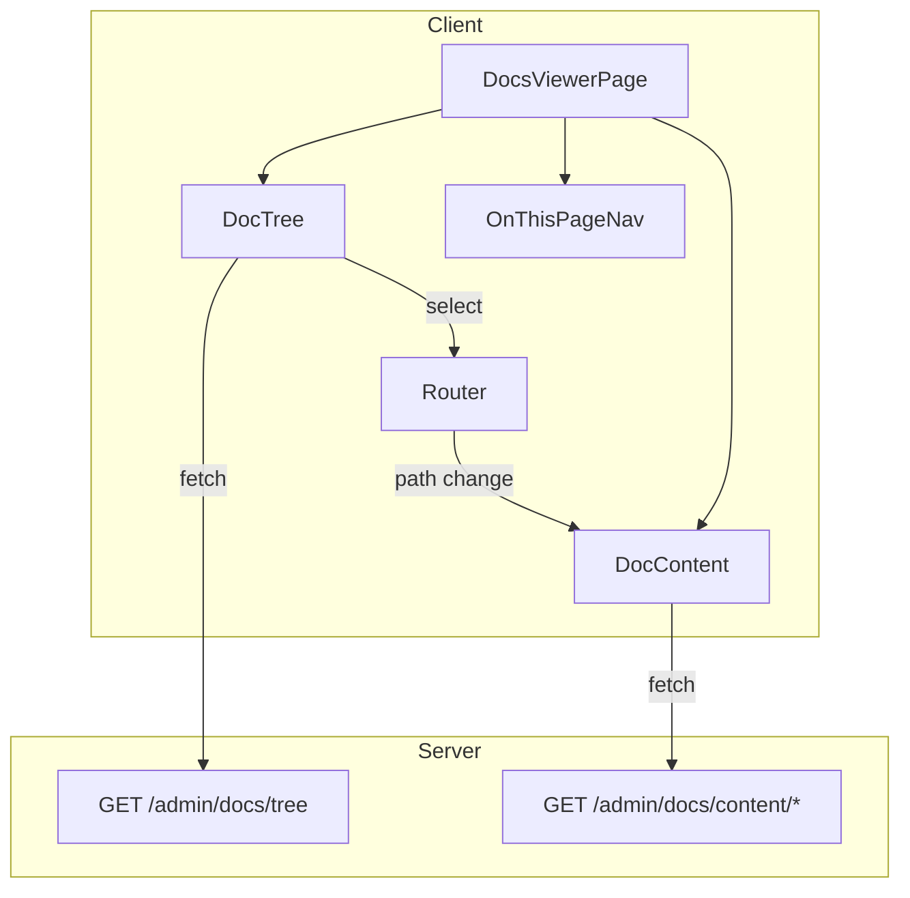

# tl-docs-viewer Skill Plan

React admin UI for browsing `docs/` folder content with tree navigation, markdown rendering, and Mermaid diagram support.

## Overview

This skill creates a browseable documentation viewer for admin interfaces. Part of the `tl-docs` suite alongside `tl-docs-create-review`.

**Primary source:** JamBase `data.jambase.com/client/src/pages/admin/readme/`

---

## Source Analysis

### Primary Source: JamBase Implementation

| Component | Description | Borrow |
|-----------|-------------|--------|
| `index.tsx` | Main viewer page with three-column layout | Full architecture |
| `DocTree` | Recursive tree navigation | Component pattern |
| `MermaidMarkdown` | Markdown + Mermaid rendering | Integration approach |
| `extractHeadings` | TOC generation from content | Algorithm |
| Server routes | `/admin/docs/tree` + `/admin/docs/content/*` | API patterns |

### Supporting Patterns

| Source | Contribution |
|--------|--------------|
| TanStack Query | Data fetching pattern |
| @uiw/react-markdown-preview | Markdown rendering |
| Mermaid | Diagram rendering |
| Wouter/React Router | Routing integration |

---

## AskQuestion Configuration Flow

The skill should gather project context before implementation.

### Question 1: Admin Area Detection

```json
{
  "title": "Admin Area",
  "questions": [{
    "id": "admin_area",
    "prompt": "Do you have an existing admin area?",
    "options": [
      {"id": "yes_show", "label": "Yes, show me — I'll point you to existing routes"},
      {"id": "no_create", "label": "No, create one — Scaffold admin layout + docs route"},
      {"id": "not_sure", "label": "Not sure — Scan for admin patterns"}
    ]
  }]
}
```

**Branching:**
- `yes_show` → Explore provided routes, propose `/admin/docs` or similar
- `no_create` → Create admin layout component + docs route
- `not_sure` → Scan for `admin`, `dashboard`, `_admin` patterns

### Question 2: Frontend Stack

```json
{
  "title": "Frontend Stack",
  "questions": [{
    "id": "frontend_stack",
    "prompt": "What's your frontend routing library?",
    "options": [
      {"id": "react_router", "label": "React Router"},
      {"id": "wouter", "label": "Wouter"},
      {"id": "next", "label": "Next.js"},
      {"id": "tanstack_router", "label": "TanStack Router"},
      {"id": "remix", "label": "Remix"},
      {"id": "other", "label": "Other — I'll specify"}
    ]
  }]
}
```

### Question 3: Route Placement

```json
{
  "title": "Route Placement",
  "questions": [{
    "id": "route_path",
    "prompt": "Where should the docs viewer live?",
    "options": [
      {"id": "detected", "label": "{{DETECTED_PATH}} — Detected admin pattern"},
      {"id": "admin_docs", "label": "/admin/docs — Standard admin path"},
      {"id": "docs", "label": "/docs — Public docs viewer"},
      {"id": "custom", "label": "Custom path — I'll specify"}
    ]
  }]
}
```

### Question 4: Layout Pattern

```json
{
  "title": "Layout Pattern",
  "questions": [{
    "id": "layout",
    "prompt": "What layout pattern for the docs viewer?",
    "options": [
      {"id": "three_column", "label": "Three-column — Tree + Content + TOC (recommended)"},
      {"id": "two_column", "label": "Two-column — Tree + Content"},
      {"id": "single", "label": "Single column — Collapsible nav"}
    ]
  }]
}
```

---

## Architecture

### Three-Column Layout

```
┌─────────────────────────────────────────────────────────────┐
│                    Admin Docs Layout                        │
├──────────┬───────────────────────────────────┬──────────────┤
│          │                                   │              │
│  DocTree │         DocContent                │ OnThisPage   │
│  (250px) │         (flex-1)                  │ (200px)      │
│          │                                   │              │
│  ├─ docs │  # Document Title                 │ - Section 1  │
│  │  ├─ a │                                   │ - Section 2  │
│  │  └─ b │  Content rendered from markdown   │   - Sub 2.1  │
│  └─ ...  │                                   │ - Section 3  │
│          │                                   │              │
└──────────┴───────────────────────────────────┴──────────────┘
```

### Data Flow



---

## Server API

### GET /admin/docs/tree

Returns folder structure as JSON tree.

**Response:**
```typescript
interface DocNode {
  name: string;
  path: string;
  type: 'file' | 'folder';
  children?: DocNode[];
}

type TreeResponse = DocNode[];
```

**Implementation:**
```typescript
async function getDocsTree(docsPath: string): Promise<DocNode[]> {
  // Recursively read docs/ directory
  // Filter to .md files
  // Build tree structure
  // Sort: folders first, then alphabetically
}
```

### GET /admin/docs/content/:path*

Returns markdown content and metadata.

**Response:**
```typescript
interface DocContent {
  content: string;
  title: string;
  lastUpdated?: string;
  path: string;
}
```

**Implementation:**
```typescript
async function getDocContent(filePath: string): Promise<DocContent> {
  // Read markdown file
  // Extract title from first H1
  // Extract Last Updated from blockquote if present
  // Return content and metadata
}
```

---

## React Components

### DocTree

Recursive tree navigation component.

```typescript
interface DocTreeProps {
  nodes: DocNode[];
  currentPath: string;
  onSelect: (path: string) => void;
}

function DocTree({ nodes, currentPath, onSelect }: DocTreeProps) {
  return (
    <ul className="doc-tree">
      {nodes.map(node => (
        <DocTreeItem 
          key={node.path} 
          node={node} 
          currentPath={currentPath}
          onSelect={onSelect}
        />
      ))}
    </ul>
  );
}
```

### DocTreeItem

Single tree node with expand/collapse.

```typescript
interface DocTreeItemProps {
  node: DocNode;
  currentPath: string;
  onSelect: (path: string) => void;
}

function DocTreeItem({ node, currentPath, onSelect }: DocTreeItemProps) {
  const [expanded, setExpanded] = useState(
    currentPath.startsWith(node.path)
  );
  
  // Render folder or file with appropriate icon
  // Handle click for navigation or expand
}
```

### MermaidMarkdown

Markdown renderer with Mermaid diagram support.

```typescript
import MarkdownPreview from '@uiw/react-markdown-preview';
import mermaid from 'mermaid';

function MermaidMarkdown({ content }: { content: string }) {
  // Initialize mermaid on mount
  // Render markdown with custom code block handling
  // Process ```mermaid blocks as diagrams
}
```

### OnThisPageNav

TOC generated from headings.

```typescript
interface Heading {
  id: string;
  text: string;
  level: number;
}

function extractHeadings(content: string): Heading[] {
  // Parse markdown for ## and ### headings
  // Generate IDs from text
  // Return heading tree
}

function OnThisPageNav({ content }: { content: string }) {
  const headings = extractHeadings(content);
  // Render nested list with anchor links
}
```

### AdminDocsLayout

Three-column layout wrapper.

```typescript
function AdminDocsLayout({ children }: { children: React.ReactNode }) {
  return (
    <div className="admin-docs-layout">
      {children}
    </div>
  );
}
```

---

## Skill Structure

```
tl-docs-viewer/
├── SKILL.md                    # Main skill
├── README.md                   # Overview with source attribution
└── references/
    ├── configuration.md        # AskQuestion flows
    ├── server-api.md           # API endpoint patterns
    ├── react-components.md     # Component architecture
    └── templates/
        ├── api-routes.ts       # Server route template
        ├── doc-viewer-page.tsx # Main page template
        ├── doc-tree.tsx        # Tree component template
        └── mermaid-markdown.tsx # Renderer template
```

---

## Implementation Steps

### Phase A: Skill Structure

1. Create skill folder at `skills/tl-docs-viewer/`
2. Create `references/` and `references/templates/` subfolders

### Phase B: Core Files

1. Write `SKILL.md` with:
   - AskQuestion configuration discovery
   - Implementation workflow
   - Component reference
2. Write `README.md` with source attribution

### Phase C: Reference Files

1. Write `references/configuration.md` — Full AskQuestion schemas
2. Write `references/server-api.md` — API endpoint documentation
3. Write `references/react-components.md` — Component architecture

### Phase D: Templates

1. Create `templates/api-routes.ts` — Server route template
2. Create `templates/doc-viewer-page.tsx` — Main page template
3. Create `templates/doc-tree.tsx` — Tree component template
4. Create `templates/mermaid-markdown.tsx` — Markdown renderer template

### Phase E: Validation

1. Verify skill is under 500 lines
2. Test trigger phrases

---

## Suite Relationship

```yaml
# In tl-docs-viewer SKILL.md:
metadata:
  suite: tl-docs
  related:
    - tl-docs-create-review
```

---

## Dependencies

The implementation will require:

| Package | Purpose |
|---------|---------|
| `@uiw/react-markdown-preview` | Markdown rendering |
| `mermaid` | Diagram rendering |
| `@tanstack/react-query` | Data fetching |
| Router library | Navigation (detected) |

---

## Verification Checklist

- [ ] SKILL.md with AskQuestion config discovery
- [ ] AskQuestion covers admin area, stack, route, layout
- [ ] Server API patterns documented
- [ ] React component architecture documented
- [ ] Templates for all major components
- [ ] Suite relationship established with tl-docs-create-review
- [ ] Source attribution to JamBase implementation
