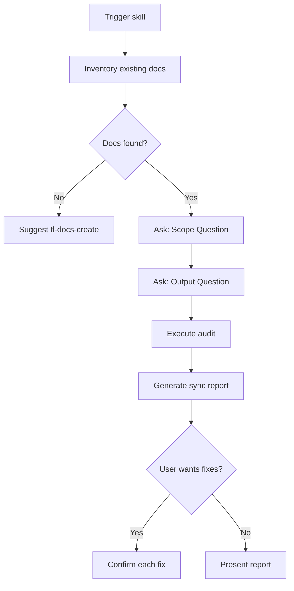

# Configuration Discovery

Use the `AskQuestion` tool to gather audit scope before analyzing documentation.

## Question Flow



---

## Question Schemas

### Question 1: No Docs Found

If no existing documentation found, redirect to create skill.

```json
{
  "title": "No Documentation Found",
  "questions": [{
    "id": "no_docs",
    "prompt": "No documentation found to audit. Would you like to create documentation instead?",
    "options": [
      {"id": "create", "label": "Create docs — Switch to tl-docs-create skill"},
      {"id": "scan_deeper", "label": "Scan deeper — Check alternative locations"},
      {"id": "cancel", "label": "Cancel — Never mind"}
    ]
  }]
}
```

### Question 2: Audit Scope

```json
{
  "title": "Audit Scope",
  "questions": [{
    "id": "scope",
    "prompt": "What scope should the audit cover?",
    "options": [
      {"id": "full", "label": "Full audit — All documentation and features"},
      {"id": "changed", "label": "Changed files — Recently modified code only"},
      {"id": "specific", "label": "Specific areas — Let me choose directories/features"},
      {"id": "staleness", "label": "Staleness only — Just find outdated docs"}
    ]
  }]
}
```

### Question 2b: Specific Areas (if specific selected)

```json
{
  "title": "Select Areas",
  "questions": [{
    "id": "areas",
    "prompt": "Which areas should I audit?",
    "allow_multiple": true,
    "options": [
      {"id": "readme", "label": "README.md"},
      {"id": "agents", "label": "AGENTS.md"},
      {"id": "api_docs", "label": "API documentation"},
      {"id": "config_docs", "label": "Configuration docs"},
      {"id": "guides", "label": "Guides and tutorials"}
    ]
  }]
}
```

### Question 3: Output Format

```json
{
  "title": "Audit Output",
  "questions": [{
    "id": "output",
    "prompt": "What should I do with the findings?",
    "options": [
      {"id": "report_only", "label": "Report only — Show me the sync report"},
      {"id": "report_and_fix", "label": "Report + fixes — Fix issues with my approval"},
      {"id": "fix_all", "label": "Fix all — Apply all fixes automatically"}
    ]
  }]
}
```

### Question 4: Fix Confirmation (per finding)

When `report_and_fix` is selected, confirm each proposed edit:

```json
{
  "title": "Confirm Fix",
  "questions": [{
    "id": "confirm_fix",
    "prompt": "[Describe the proposed fix]",
    "options": [
      {"id": "apply", "label": "Apply this fix"},
      {"id": "skip", "label": "Skip this one"},
      {"id": "modify", "label": "Let me modify first"}
    ]
  }]
}
```

---

## Branching Logic

| Initial Answer | Next Questions | Action |
|----------------|----------------|--------|
| Full audit | Output | Audit all docs and code |
| Changed files | Output | Audit git diff scope |
| Specific areas | Areas, Output | Audit selected areas |
| Staleness only | Output | Check dates and links only |
| Report only | — | Generate report, present |
| Report + fixes | Fix confirmations | Fix with approval |
| Fix all | — | Apply all fixes |

---

## Example Question Flows

### Flow 1: Full Audit with Fixes

1. Scan → Found README.md, docs/ folder
2. Ask Scope → "Full audit"
3. Ask Output → "Report + fixes"
4. Execute audit, generate sync report
5. For each finding, ask Fix Confirmation
6. Apply approved fixes

### Flow 2: Staleness Check

1. Scan → Found comprehensive docs
2. Ask Scope → "Staleness only"
3. Ask Output → "Report only"
4. Check dates, links, deprecated references
5. Present staleness report

### Flow 3: Changed Files Quick Check

1. Scan → Found docs
2. Ask Scope → "Changed files"
3. Ask Output → "Report + fixes"
4. Check git diff for changed code
5. Cross-reference affected docs
6. Fix with approval
