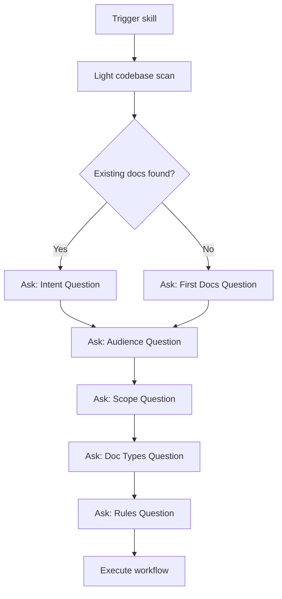

# Configuration Discovery

Use the `AskQuestion` tool to gather user intent before creating documentation. Questions are asked after a light exploration when context helps frame the question.

## Question Flow



---

## Question Schemas

### Question 1a: Intent (when existing docs found)

**Trigger:** Check for `docs/`, `README.md`, `AGENTS.md`, `CHANGELOG.md`

```json
{
  "title": "Documentation Intent",
  "questions": [{
    "id": "intent",
    "prompt": "I found existing documentation. What would you like to do?",
    "options": [
      {"id": "replace", "label": "Replace — Start fresh, existing docs are outdated/wrong"},
      {"id": "revise", "label": "Revise — Update existing docs to match current code"},
      {"id": "supplement", "label": "Supplement — Add new docs without changing existing"},
      {"id": "audit", "label": "Audit — Review quality and coverage, suggest improvements"},
      {"id": "unsure", "label": "Unsure — Help me decide what's needed"}
    ]
  }]
}
```

### Question 1b: First Documentation (when no docs found)

```json
{
  "title": "First Documentation",
  "questions": [{
    "id": "first_docs",
    "prompt": "No documentation found. Is there existing docs elsewhere, or is this the first effort?",
    "options": [
      {"id": "first", "label": "First effort — Create documentation from scratch"},
      {"id": "elsewhere", "label": "Docs exist elsewhere — I'll point you to them"},
      {"id": "minimal", "label": "Minimal needed — Just README and AGENTS.md"}
    ]
  }]
}
```

### Question 2: Audience

```json
{
  "title": "Documentation Audience",
  "questions": [{
    "id": "audience",
    "prompt": "Who is the primary audience for this documentation?",
    "allow_multiple": true,
    "options": [
      {"id": "contributors", "label": "Contributors — Developers who will work on this codebase"},
      {"id": "users", "label": "Users — People who will use this project/library/API"},
      {"id": "operators", "label": "Operators — People who deploy and maintain in production"},
      {"id": "future_self", "label": "Future self — Personal project, you're the main reader"},
      {"id": "mixed", "label": "Mixed — Multiple audiences need different docs"}
    ]
  }]
}
```

### Question 3: Scope/Depth

```json
{
  "title": "Documentation Depth",
  "questions": [{
    "id": "scope",
    "prompt": "How comprehensive should the documentation be?",
    "options": [
      {"id": "minimal", "label": "Minimal — Essential info only (README, setup, key commands)"},
      {"id": "standard", "label": "Standard — Typical project docs (README, AGENTS.md, architecture)"},
      {"id": "comprehensive", "label": "Comprehensive — Full docs site with guides, API reference, examples"},
      {"id": "absurd", "label": "Absurdly thorough — The kind of docs you wish every project had"}
    ]
  }]
}
```

### Question 4: Doc Types

```json
{
  "title": "Documentation Artifacts",
  "questions": [{
    "id": "doc_types",
    "prompt": "Which documentation artifacts should I create or update?",
    "allow_multiple": true,
    "options": [
      {"id": "readme", "label": "README.md — Project overview, setup, usage"},
      {"id": "agents", "label": "AGENTS.md — AI assistant context and commands"},
      {"id": "changelog", "label": "CHANGELOG.md — Version history and changes"},
      {"id": "docs_folder", "label": "docs/ folder — Structured documentation hierarchy"},
      {"id": "api_reference", "label": "API reference — Endpoint/function documentation"},
      {"id": "contributing", "label": "CONTRIBUTING.md — Contribution guidelines"},
      {"id": "docs_viewer", "label": "Docs Viewer UI — Admin interface (see tl-docs-viewer skill)"}
    ]
  }]
}
```

### Question 4b: Docs Viewer (if docs_viewer selected)

```json
{
  "title": "Docs Viewer UI",
  "questions": [{
    "id": "docs_viewer_action",
    "prompt": "The docs viewer is a separate skill (tl-docs-viewer) that creates a React admin UI. Would you like me to:",
    "options": [
      {"id": "recommend", "label": "Recommend it — Point me to tl-docs-viewer after docs are created"},
      {"id": "create_now", "label": "Create it now — Switch to tl-docs-viewer skill to build the UI"},
      {"id": "skip", "label": "Skip — I'll handle the viewer separately"}
    ]
  }]
}
```

### Question 5: Style Preferences (for comprehensive scope)

```json
{
  "title": "Style Preferences",
  "questions": [{
    "id": "style",
    "prompt": "Any specific style preferences?",
    "options": [
      {"id": "default", "label": "Use skill defaults — Professional, direct, scannable"},
      {"id": "casual", "label": "More casual — Friendly, conversational tone"},
      {"id": "formal", "label": "More formal — Enterprise/corporate tone"},
      {"id": "tutorial", "label": "Tutorial-style — Step-by-step with explanations"}
    ]
  }]
}
```

### Question 6: Documentation Rules

```json
{
  "title": "Documentation Rules",
  "questions": [{
    "id": "rules",
    "prompt": "Should I create Cursor rules to enforce documentation standards?",
    "options": [
      {"id": "yes_full", "label": "Yes — Create rules for all selected doc types"},
      {"id": "yes_pick", "label": "Yes, let me pick — Choose specific rules"},
      {"id": "no", "label": "No rules — Just create the docs"}
    ]
  }]
}
```

### Question 6b: Rule Selection (if yes_pick selected)

```json
{
  "title": "Select Documentation Rules",
  "questions": [{
    "id": "rule_selection",
    "prompt": "Which documentation rules should I create?",
    "allow_multiple": true,
    "options": [
      {"id": "readme_sync", "label": "README sync — Update when package.json, major features change"},
      {"id": "changelog_commits", "label": "CHANGELOG from commits — Prompt to update on conventional commits"},
      {"id": "api_doc_sync", "label": "API doc sync — Update docs when endpoints/functions change"},
      {"id": "agents_md_maintain", "label": "AGENTS.md maintenance — Keep commands and conventions current"},
      {"id": "doc_style", "label": "Doc style standards — Enforce voice, tone, formatting"},
      {"id": "last_updated", "label": "Last Updated tracking — Add/update dates on doc changes"},
      {"id": "link_check", "label": "Link validation — Check internal doc links on save"}
    ]
  }]
}
```

---

## Branching Logic

| Initial Answer | Next Questions | Skip Questions |
|----------------|----------------|----------------|
| Replace | Audience, Scope, Types, Style, Rules | — |
| Revise | Audience (confirm), Types (pre-selected) | Scope (inherit) |
| Supplement | Audience, Types, Rules | Scope (match existing) |
| Audit | — | All (just analyze, produce report) |
| Minimal needed | — | Audience, Scope, Types (preset to README + AGENTS.md) |
| Absurdly thorough | All questions | — |

---

## Integration Points by Phase

| Phase | Question Trigger | Purpose |
|-------|------------------|---------|
| Before Assessment | Light scan completed | Determine if docs exist |
| Assessment | Docs found/not found | Intent question |
| Doc Type Selection | Intent answered | Types question |
| Standards | Comprehensive or absurd selected | Style preferences |
| Gap Analysis | Revise or Supplement selected | Confirm which gaps to fill |
| Execution | Doc types selected | Rules question |
| Verification | Draft complete | Confirm before finalizing |

---

## Example Question Flows

### Flow 1: New Project

1. Light scan → No docs found
2. Ask First Docs → "First effort"
3. Ask Audience → "Contributors"
4. Ask Scope → "Standard"
5. Ask Types → README, AGENTS.md, CHANGELOG
6. Ask Rules → "Yes, create rules"
7. Execute workflow with selections

### Flow 2: Updating Existing Docs

1. Light scan → Found README.md, docs/ folder
2. Ask Intent → "Revise"
3. Ask Types → Pre-selected existing types, allow adding
4. Skip Scope (inherit from existing)
5. Ask Rules → "No rules"
6. Execute gap analysis and updates

### Flow 3: Audit Only

1. Light scan → Found comprehensive docs
2. Ask Intent → "Audit"
3. Skip all other questions
4. Run gap analysis, produce report
5. Present findings without making changes

### Flow 4: Absurdly Thorough

1. Light scan → Minimal README only
2. Ask Intent → "Replace"
3. Ask Audience → "Mixed" (contributors + users)
4. Ask Scope → "Absurdly thorough"
5. Ask Types → All types selected
6. Ask Style → "Tutorial-style"
7. Ask Rules → "Yes, let me pick" → Select all rules
8. Deep exploration, comprehensive documentation
