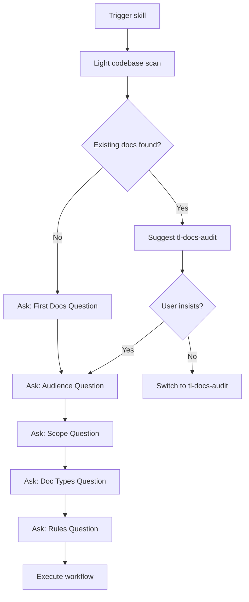

# Configuration Discovery

Use the `AskQuestion` tool to gather user intent before creating documentation. Questions are asked after a light exploration when context helps frame the question.

## Question Flow



---

## Question Schemas

### Question 1: Existing Docs Check

**Trigger:** Check for `docs/`, `README.md`, `AGENTS.md`, `CHANGELOG.md`

If existing docs found, suggest using `tl-docs-audit` instead:

```json
{
  "title": "Existing Documentation Found",
  "questions": [{
    "id": "existing_docs",
    "prompt": "I found existing documentation. This skill is for creating new docs. Would you like to:",
    "options": [
      {"id": "audit", "label": "Audit existing docs — Switch to tl-docs-audit skill"},
      {"id": "replace", "label": "Replace everything — Start fresh from scratch"},
      {"id": "add_new", "label": "Add new types — Create docs that don't exist yet"}
    ]
  }]
}
```

### Question 2: First Documentation (when no docs found)

```json
{
  "title": "First Documentation",
  "questions": [{
    "id": "first_docs",
    "prompt": "No documentation found. What approach would you like?",
    "options": [
      {"id": "first", "label": "Full documentation — Create comprehensive docs from scratch"},
      {"id": "minimal", "label": "Minimal — Just README and AGENTS.md"},
      {"id": "elsewhere", "label": "Docs exist elsewhere — I'll point you to them"}
    ]
  }]
}
```

### Question 3: Audience

```json
{
  "title": "Documentation Audience",
  "questions": [{
    "id": "audience",
    "prompt": "Who is the primary audience for this documentation?",
    "allow_multiple": true,
    "options": [
      {"id": "contributors", "label": "Contributors — Developers who will work on this codebase"},
      {"id": "users", "label": "Users — People who will use this project/library/API"},
      {"id": "operators", "label": "Operators — People who deploy and maintain in production"},
      {"id": "future_self", "label": "Future self — Personal project, you're the main reader"},
      {"id": "mixed", "label": "Mixed — Multiple audiences need different docs"}
    ]
  }]
}
```

### Question 4: Scope/Depth

```json
{
  "title": "Documentation Depth",
  "questions": [{
    "id": "scope",
    "prompt": "How comprehensive should the documentation be?",
    "options": [
      {"id": "minimal", "label": "Minimal — Essential info only (README, setup, key commands)"},
      {"id": "standard", "label": "Standard — Typical project docs (README, AGENTS.md, architecture)"},
      {"id": "comprehensive", "label": "Comprehensive — Full docs site with guides, API reference, examples"},
      {"id": "absurd", "label": "Absurdly thorough — The kind of docs you wish every project had"}
    ]
  }]
}
```

### Question 5: Doc Types

```json
{
  "title": "Documentation Artifacts",
  "questions": [{
    "id": "doc_types",
    "prompt": "Which documentation artifacts should I create?",
    "allow_multiple": true,
    "options": [
      {"id": "readme", "label": "README.md — Project overview, setup, usage"},
      {"id": "agents", "label": "AGENTS.md — AI assistant context and commands"},
      {"id": "changelog", "label": "CHANGELOG.md — Version history and changes"},
      {"id": "docs_folder", "label": "docs/ folder — Structured documentation hierarchy"},
      {"id": "api_reference", "label": "API reference — Endpoint/function documentation"},
      {"id": "contributing", "label": "CONTRIBUTING.md — Contribution guidelines"},
      {"id": "docs_viewer", "label": "Docs Viewer UI — Admin interface (see tl-docs-viewer-create skill)"}
    ]
  }]
}
```

### Question 5b: Docs Viewer (if docs_viewer selected)

```json
{
  "title": "Docs Viewer UI",
  "questions": [{
    "id": "docs_viewer_action",
    "prompt": "The docs viewer is a separate skill (tl-docs-viewer-create) that creates a React admin UI. Would you like me to:",
    "options": [
      {"id": "recommend", "label": "Recommend it — Point me to tl-docs-viewer-create after docs are created"},
      {"id": "create_now", "label": "Create it now — Switch to tl-docs-viewer-create skill to build the UI"},
      {"id": "skip", "label": "Skip — I'll handle the viewer separately"}
    ]
  }]
}
```

### Question 6: Documentation Rules

```json
{
  "title": "Documentation Rules",
  "questions": [{
    "id": "rules",
    "prompt": "Should I create Cursor rules to enforce documentation standards?",
    "options": [
      {"id": "yes_full", "label": "Yes — Create rules for all selected doc types"},
      {"id": "yes_pick", "label": "Yes, let me pick — Choose specific rules"},
      {"id": "no", "label": "No rules — Just create the docs"}
    ]
  }]
}
```

### Question 6b: Rule Selection (if yes_pick selected)

```json
{
  "title": "Select Documentation Rules",
  "questions": [{
    "id": "rule_selection",
    "prompt": "Which documentation rules should I create?",
    "allow_multiple": true,
    "options": [
      {"id": "readme_sync", "label": "README sync — Update when package.json, major features change"},
      {"id": "changelog_commits", "label": "CHANGELOG from commits — Prompt to update on conventional commits"},
      {"id": "api_doc_sync", "label": "API doc sync — Update docs when endpoints/functions change"},
      {"id": "agents_md_maintain", "label": "AGENTS.md maintenance — Keep commands and conventions current"},
      {"id": "doc_style", "label": "Doc style standards — Enforce voice, tone, formatting"},
      {"id": "last_updated", "label": "Last Updated tracking — Add/update dates on doc changes"},
      {"id": "link_check", "label": "Link validation — Check internal doc links on save"}
    ]
  }]
}
```

---

## Branching Logic

| Initial Answer | Next Questions | Skip Questions |
|----------------|----------------|----------------|
| Audit | — | All (redirect to tl-docs-audit) |
| Replace | Audience, Scope, Types, Rules | — |
| Add new | Audience, Types, Rules | Scope (standard) |
| Minimal needed | — | Audience, Scope, Types (preset to README + AGENTS.md) |
| Absurdly thorough | All questions | — |

---

## Example Question Flows

### Flow 1: New Project (No Existing Docs)

1. Light scan → No docs found
2. Ask First Docs → "Full documentation"
3. Ask Audience → "Contributors"
4. Ask Scope → "Standard"
5. Ask Types → README, AGENTS.md, CHANGELOG
6. Ask Rules → "Yes, create rules"
7. Execute workflow with selections

### Flow 2: Minimal Quick Start

1. Light scan → No docs found
2. Ask First Docs → "Minimal"
3. Skip remaining questions
4. Create README.md and AGENTS.md only

### Flow 3: Existing Docs → Redirect to Audit

1. Light scan → Found README.md, docs/ folder
2. Ask Existing Docs → "Audit existing docs"
3. Redirect to `tl-docs-audit` skill

### Flow 4: Replace Existing Docs

1. Light scan → Found outdated docs
2. Ask Existing Docs → "Replace everything"
3. Ask Audience → "Mixed" (contributors + users)
4. Ask Scope → "Comprehensive"
5. Ask Types → All types selected
6. Ask Rules → "Yes, let me pick" → Select all rules
7. Deep exploration, comprehensive documentation
