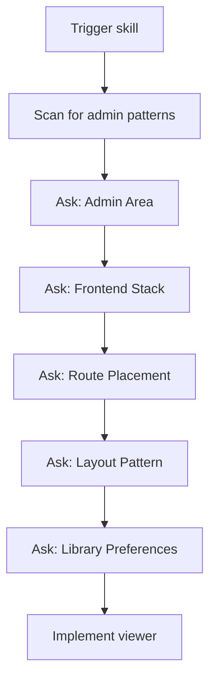
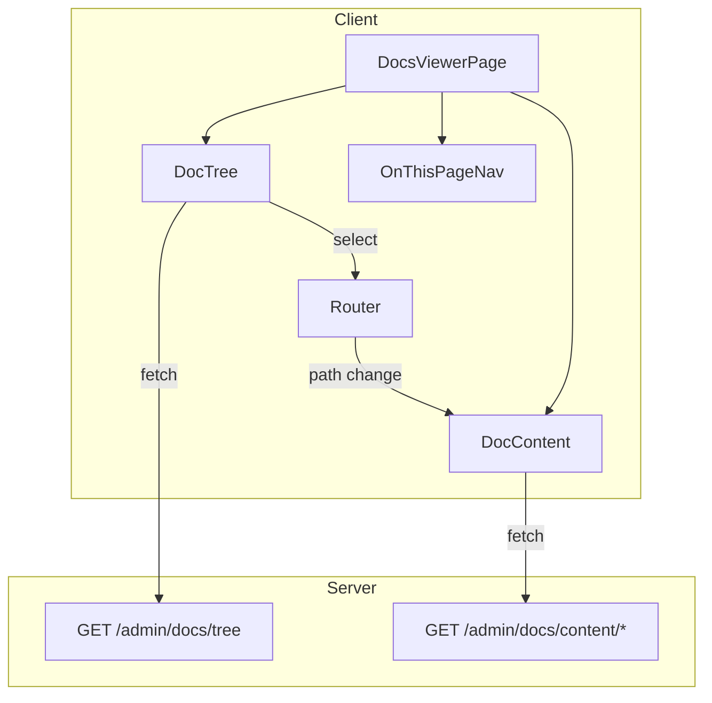

<!-- Copyright (c) 2026 Todd Levy. Licensed under MIT. SPDX-License-Identifier: MIT -->

# Documentation Viewer UI

Create a browseable documentation viewer for admin interfaces with tree navigation, markdown rendering, and Mermaid diagram support.

## When to Use

- "create docs viewer"
- "add documentation browser"
- "admin docs UI"
- "browse docs folder"
- "docs viewer component"
- Adding a docs/ browser to an existing admin area
- Need to view markdown documentation in-app

## Outcomes

- **Artifact**: React page component with three-column layout (tree + content + TOC)
- **Artifact**: Server API endpoints for tree and content
- **Artifact**: Supporting components (DocTree, MermaidMarkdown, OnThisPageNav)
- **Decision**: Route placement and library choices

---

## Configuration Discovery

Before implementation, gather project context through structured questions. See `references/configuration.md` for full schemas.

### Question Flow



### Questions Summary

1. **Admin Area Detection** — Existing admin area? (yes/no/scan)
2. **Frontend Stack** — React Router / Wouter / Next.js / TanStack Router / Remix
3. **Route Placement** — Detected path / /admin/docs / /docs / custom
4. **Layout Pattern** — Three-column / Two-column / Single column
5. **Library Preferences** — Markdown renderer + data fetching choices

---

## Architecture

### Three-Column Layout (Default)

```
┌─────────────────────────────────────────────────────────────┐
│                    Admin Docs Layout                        │
├──────────┬───────────────────────────────────┬──────────────┤
│          │                                   │              │
│  DocTree │         DocContent                │ OnThisPage   │
│  (250px) │         (flex-1)                  │ (200px)      │
│          │                                   │              │
│  ├─ docs │  # Document Title                 │ - Section 1  │
│  │  ├─ a │                                   │ - Section 2  │
│  │  └─ b │  Content rendered from markdown   │   - Sub 2.1  │
│  └─ ...  │                                   │ - Section 3  │
│          │                                   │              │
└──────────┴───────────────────────────────────┴──────────────┘
```

### Data Flow



---

## Phase 1: Server API

Create two endpoints. See `references/server-api.md` for full patterns.

### GET /admin/docs/tree

Returns folder structure as JSON tree.

```typescript
interface DocNode {
  name: string;
  path: string;
  type: 'file' | 'folder';
  children?: DocNode[];
}
```

### GET /admin/docs/content/:path*

Returns markdown content and metadata.

```typescript
interface DocContent {
  content: string;
  title: string;
  lastUpdated?: string;
  path: string;
}
```

---

## Phase 2: React Components

Create the component hierarchy. See `references/react-components.md` for full architecture.

### Components

| Component | Purpose |
|-----------|---------|
| `AdminDocsLayout` | Three-column layout wrapper |
| `DocTree` | Recursive tree navigation |
| `DocTreeItem` | Single tree node with expand/collapse |
| `MermaidMarkdown` | Markdown renderer with Mermaid support |
| `OnThisPageNav` | TOC generated from headings |

---

## Phase 3: Integration

### Route Setup

Based on detected frontend stack:

| Stack | Route Pattern |
|-------|---------------|
| React Router | `<Route path="/admin/docs/*" element={<DocsViewer />} />` |
| Wouter | `<Route path="/admin/docs/:path*" component={DocsViewer} />` |
| Next.js | `app/admin/docs/[[...path]]/page.tsx` |
| TanStack Router | `createRoute({ path: '/admin/docs/$path', component: DocsViewer })` |

### Data Fetching

Based on library preference:

| Library | Pattern |
|---------|---------|
| TanStack Query | `useQuery({ queryKey: ['docs', 'tree'], queryFn: fetchTree })` |
| SWR | `useSWR('/admin/docs/tree', fetcher)` |
| Native fetch | `useEffect` + `useState` pattern |

---

## Dependencies

Configurable via AskQuestion:

| Category | Default | Alternatives |
|----------|---------|--------------|
| Markdown | @uiw/react-markdown-preview | react-markdown, marked |
| Data fetching | @tanstack/react-query | swr, native fetch |
| Diagrams | mermaid | Optional |

---

## Verification

After implementation, verify:

- [ ] Tree loads and displays folder structure
- [ ] Clicking file loads markdown content
- [ ] Mermaid diagrams render (if enabled)
- [ ] TOC generates from headings
- [ ] Route navigation works
- [ ] Dark mode supported (if applicable)

---

## References

| File | Purpose |
|------|---------|
| `references/configuration.md` | AskQuestion flows and branching |
| `references/server-api.md` | API endpoint patterns |
| `references/react-components.md` | Component architecture |
| `references/templates/` | Code templates |

---

---

## Markdown Rendering

### Streamdown (Recommended)

Streaming-optimized React Markdown renderer with built-in Shiki and Mermaid support.

```tsx
import { Streamdown } from 'streamdown';
import { code } from '@streamdown/code';
import { mermaid } from '@streamdown/mermaid';

<Streamdown 
  mode="static" 
  plugins={{ code, mermaid }}
  shikiTheme={['github-light', 'github-dark']}
>
  {content}
</Streamdown>
```

**Tailwind v4 Setup** — Add to `globals.css`:

```css
@source "../node_modules/streamdown/dist/*.js";
@source "../node_modules/@streamdown/code/dist/*.js";
@source "../node_modules/@streamdown/mermaid/dist/*.js";
```

**Key Props:**

| Prop | Type | Purpose |
|------|------|---------|
| `mode` | `"streaming" \| "static"` | Use `static` for docs |
| `plugins` | `{ code?, mermaid?, math? }` | Feature plugins |
| `shikiTheme` | `[light, dark]` | Code block themes |
| `controls` | `boolean` | Copy buttons |

### Alternative: react-markdown

If not using Streamdown:

```tsx
import ReactMarkdown from 'react-markdown';
import rehypeHighlight from 'rehype-highlight';
import remarkGfm from 'remark-gfm';

<ReactMarkdown
  remarkPlugins={[remarkGfm]}
  rehypePlugins={[rehypeHighlight]}
>
  {content}
</ReactMarkdown>
```

---

## Search Integration

### Pagefind (Static Search)

Best for pre-built docs. Index at build time, search client-side.

```tsx
import { search } from '@pagefind/default-ui';

const results = await search(query);
```

### Flexsearch (Client-Side)

Best for dynamic docs loaded at runtime.

```tsx
import FlexSearch from 'flexsearch';

const index = new FlexSearch.Index();
docs.forEach((doc, id) => index.add(id, doc.content));
const results = index.search(query);
```

### Search Modal Pattern

```tsx
function SearchModal({ isOpen, onClose }) {
  const [query, setQuery] = useState('');
  const results = useSearch(query);

  return (
    <dialog open={isOpen} onClose={onClose}>
      <input 
        value={query} 
        onChange={e => setQuery(e.target.value)}
        placeholder="Search docs..."
        autoFocus
      />
      <ul role="listbox">
        {results.map(r => (
          <li key={r.path} role="option">
            <a href={r.path}>{r.title}</a>
          </li>
        ))}
      </ul>
    </dialog>
  );
}
```

---

## Keyboard Navigation

### Required Shortcuts

| Key | Action |
|-----|--------|
| `/` or `Cmd+K` | Open search |
| `Esc` | Close search/modal |
| `↑` `↓` | Navigate results |
| `Enter` | Select result |
| `j` `k` | Navigate tree (optional) |

### Implementation

```tsx
useEffect(() => {
  const handler = (e: KeyboardEvent) => {
    if (e.key === '/' && !isInputFocused()) {
      e.preventDefault();
      openSearch();
    }
    if ((e.metaKey || e.ctrlKey) && e.key === 'k') {
      e.preventDefault();
      openSearch();
    }
  };
  document.addEventListener('keydown', handler);
  return () => document.removeEventListener('keydown', handler);
}, []);
```

---

## Accessibility

### ARIA Requirements

```tsx
<nav aria-label="Documentation navigation">
  <ul role="tree" aria-label="Docs tree">
    <li role="treeitem" aria-expanded={isOpen} aria-selected={isSelected}>
      <button onClick={toggle}>{name}</button>
    </li>
  </ul>
</nav>

<main role="main" aria-label="Documentation content">
  <article>{content}</article>
</main>

<nav aria-label="On this page">
  <ul>{headings.map(h => <li key={h.id}><a href={`#${h.id}`}>{h.text}</a></li>)}</ul>
</nav>
```

### Focus Management

```tsx
function DocTree({ items }) {
  const [focusedIndex, setFocusedIndex] = useState(0);
  
  const handleKeyDown = (e: KeyboardEvent) => {
    if (e.key === 'ArrowDown') setFocusedIndex(i => Math.min(i + 1, items.length - 1));
    if (e.key === 'ArrowUp') setFocusedIndex(i => Math.max(i - 1, 0));
    if (e.key === 'Enter') selectItem(items[focusedIndex]);
  };

  return (
    <ul role="tree" onKeyDown={handleKeyDown}>
      {items.map((item, i) => (
        <li 
          key={item.path} 
          role="treeitem"
          tabIndex={i === focusedIndex ? 0 : -1}
          ref={i === focusedIndex ? focusedRef : null}
        >
          {item.name}
        </li>
      ))}
    </ul>
  );
}
```

---

## MDX Support

For interactive documentation with embedded components:

```tsx
import { compile, run } from '@mdx-js/mdx';
import * as runtime from 'react/jsx-runtime';

async function renderMDX(source: string, components: Record<string, Component>) {
  const compiled = await compile(source, { outputFormat: 'function-body' });
  const { default: Content } = await run(compiled, runtime);
  return <Content components={components} />;
}
```

**Custom Components:**

```tsx
const components = {
  CodePlayground: ({ code }) => <LiveEditor code={code} />,
  Callout: ({ type, children }) => <aside className={`callout-${type}`}>{children}</aside>,
  Steps: ({ children }) => <ol className="steps">{children}</ol>,
};
```

---

## Documentation Writing Guidelines

From remotion-dev patterns:

- **One API per page** — Each function/component gets its own page
- **Don't assume it's easy** — Avoid "simply" and "just"
- **Address as "you"** — Not "we"
- **Keep it brief** — Extra words cause information loss
- **Use headings for fields** — Not bullet points for API options
- **Add titles to code fences** — Always include file context

---

## Related Skills

- [tl-docs-create](../tl-docs-create/SKILL.md) — Create documentation from scratch
- [tl-docs-audit](../tl-docs-audit/SKILL.md) — Audit docs coverage, find gaps, generate sync reports

---

## References

### Quilted Skills

- [vercel/streamdown](https://skills.sh/vercel/streamdown/streamdown) — Streaming markdown renderer
- [remotion-dev/remotion/writing-docs](https://skills.sh/remotion-dev/remotion/writing-docs) — Documentation patterns
- [vercel/components.build/building-components](https://skills.sh/vercel/components.build/building-components) — Component architecture

### First-Party Documentation

- [Streamdown](https://github.com/vercel/streamdown) — Streaming markdown renderer
- [Shiki](https://shiki.style/) — Syntax highlighting
- [Mermaid](https://mermaid.js.org/) — Diagrams
- [Pagefind](https://pagefind.app/) — Static site search
- [Flexsearch](https://github.com/nextapps-de/flexsearch) — Full-text search
- [MDX](https://mdxjs.com/) — Markdown + JSX

### Accessibility

- [WAI-ARIA Tree View](https://www.w3.org/WAI/ARIA/apg/patterns/treeview/) — Tree navigation pattern
- [WAI-ARIA Combobox](https://www.w3.org/WAI/ARIA/apg/patterns/combobox/) — Search modal pattern
- [React Aria](https://react-spectrum.adobe.com/react-aria/) — Accessible component primitives
