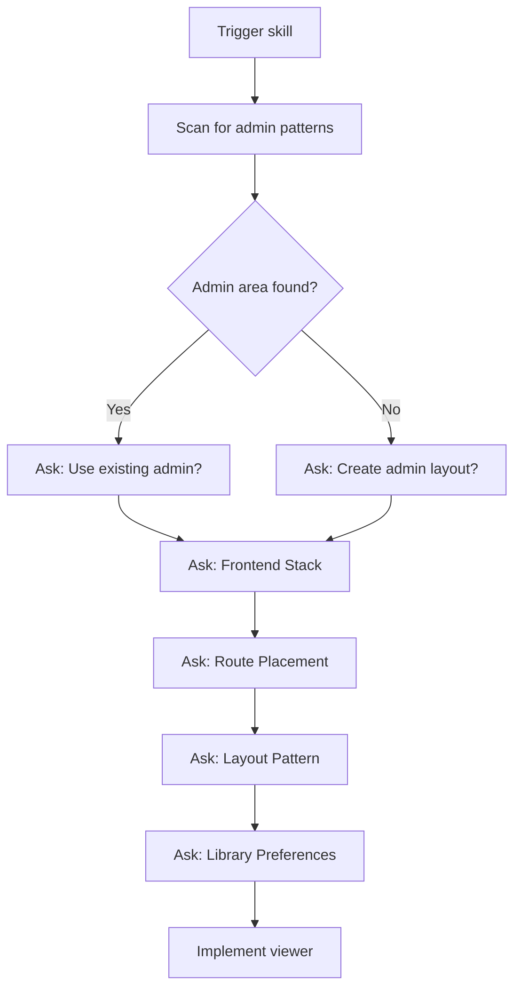

# Configuration Discovery

Use the `AskQuestion` tool to gather project context before implementing the docs viewer.

---

## Question Flow



---

## Question Schemas

### Question 1: Admin Area Detection

**Before asking:** Scan for existing admin patterns:
- Look for `/admin`, `/_admin`, `/dashboard` routes
- Check for admin layout components
- Search for terms like `AdminLayout`, `DashboardLayout`

```json
{
  "title": "Admin Area",
  "questions": [{
    "id": "admin_area",
    "prompt": "Do you have an existing admin area?",
    "options": [
      {"id": "yes_show", "label": "Yes, show me — I'll point you to existing routes"},
      {"id": "no_create", "label": "No, create one — Scaffold admin layout + docs route"},
      {"id": "not_sure", "label": "Not sure — Scan for admin patterns"}
    ]
  }]
}
```

**Branching:**

| Answer | Next Action |
|--------|-------------|
| `yes_show` | User provides route/component path, explore and propose `/admin/docs` |
| `no_create` | Create minimal admin layout component, then add docs route |
| `not_sure` | Scan for `admin`, `dashboard`, `_admin` patterns, report findings |

---

### Question 2: Frontend Stack

```json
{
  "title": "Frontend Stack",
  "questions": [{
    "id": "frontend_stack",
    "prompt": "What's your frontend routing library?",
    "options": [
      {"id": "react_router", "label": "React Router"},
      {"id": "wouter", "label": "Wouter"},
      {"id": "next", "label": "Next.js"},
      {"id": "tanstack_router", "label": "TanStack Router"},
      {"id": "remix", "label": "Remix"},
      {"id": "other", "label": "Other — I'll specify"}
    ]
  }]
}
```

**Auto-detection:** Before asking, check for:
- `react-router-dom` in package.json → React Router
- `wouter` in package.json → Wouter
- `next` in package.json → Next.js
- `@tanstack/react-router` in package.json → TanStack Router
- `@remix-run/react` in package.json → Remix

If detected, pre-select the option and confirm with user.

---

### Question 3: Route Placement

```json
{
  "title": "Route Placement",
  "questions": [{
    "id": "route_path",
    "prompt": "Where should the docs viewer live?",
    "options": [
      {"id": "detected", "label": "{{DETECTED_PATH}} — Detected admin pattern"},
      {"id": "admin_docs", "label": "/admin/docs — Standard admin path"},
      {"id": "docs", "label": "/docs — Public docs viewer"},
      {"id": "custom", "label": "Custom path — I'll specify"}
    ]
  }]
}
```

**Dynamic option:** Replace `{{DETECTED_PATH}}` with actual detected path (for example, `/dashboard/docs` if admin is at `/dashboard`).

---

### Question 4: Layout Pattern

```json
{
  "title": "Layout Pattern",
  "questions": [{
    "id": "layout",
    "prompt": "What layout pattern for the docs viewer?",
    "options": [
      {"id": "three_column", "label": "Three-column — Tree + Content + TOC (recommended)"},
      {"id": "two_column", "label": "Two-column — Tree + Content"},
      {"id": "single", "label": "Single column — Collapsible nav"}
    ]
  }]
}
```

**Layout descriptions:**

| Layout | Structure | Best For |
|--------|-----------|----------|
| Three-column | Tree (250px) + Content (flex) + TOC (200px) | Full documentation sites |
| Two-column | Tree (250px) + Content (flex) | Simpler docs, mobile-friendly |
| Single | Collapsible nav + Content | Mobile-first, minimal UI |

---

### Question 5: Library Preferences

```json
{
  "title": "Library Preferences",
  "questions": [
    {
      "id": "markdown_lib",
      "prompt": "Which markdown rendering library?",
      "options": [
        {"id": "uiw", "label": "@uiw/react-markdown-preview (recommended) — Full-featured, syntax highlighting"},
        {"id": "react_markdown", "label": "react-markdown — Lightweight, customizable"},
        {"id": "other", "label": "Other — I'll specify or already have one"}
      ]
    },
    {
      "id": "data_fetching",
      "prompt": "Which data fetching library?",
      "options": [
        {"id": "tanstack", "label": "TanStack Query (recommended) — Caching, refetching, devtools"},
        {"id": "swr", "label": "SWR — Simple, stale-while-revalidate"},
        {"id": "native", "label": "Native fetch — No additional dependency"}
      ]
    },
    {
      "id": "mermaid",
      "prompt": "Include Mermaid diagram support?",
      "options": [
        {"id": "yes", "label": "Yes — Render ```mermaid code blocks as diagrams"},
        {"id": "no", "label": "No — Skip diagram support"}
      ]
    }
  ]
}
```

**Existing library detection:** Before asking, check package.json:
- If `@tanstack/react-query` present → pre-select TanStack Query
- If `swr` present → pre-select SWR
- If `@uiw/react-markdown-preview` present → pre-select uiw
- If `react-markdown` present → pre-select react-markdown

---

## Configuration Summary

After all questions, summarize choices:

```markdown
## Docs Viewer Configuration

- **Admin area**: Using existing at `/admin`
- **Frontend stack**: React Router
- **Route**: `/admin/docs/*`
- **Layout**: Three-column
- **Markdown**: @uiw/react-markdown-preview
- **Data fetching**: TanStack Query
- **Mermaid**: Enabled

Proceeding with implementation...
```

---

## Example Flows

### Flow 1: Existing Admin with TanStack Query

1. Scan → Found `/admin` routes
2. Ask Admin Area → "Yes, show me" → User points to `AdminLayout.tsx`
3. Ask Stack → Auto-detected React Router, confirmed
4. Ask Route → `/admin/docs` (standard)
5. Ask Layout → Three-column
6. Ask Libraries → TanStack Query already installed, Mermaid yes
7. Implement with existing patterns

### Flow 2: New Project, Minimal Setup

1. Scan → No admin found
2. Ask Admin Area → "No, create one"
3. Ask Stack → "Wouter"
4. Ask Route → `/docs` (public)
5. Ask Layout → Two-column
6. Ask Libraries → Native fetch, no Mermaid
7. Create minimal admin layout + docs viewer

### Flow 3: Next.js App Router

1. Scan → Found `/app/admin` directory
2. Ask Admin Area → "Yes"
3. Ask Stack → Auto-detected Next.js
4. Ask Route → `/admin/docs` → creates `app/admin/docs/[[...path]]/page.tsx`
5. Ask Layout → Three-column
6. Ask Libraries → react-markdown (already in project), SWR
7. Implement with Next.js patterns
