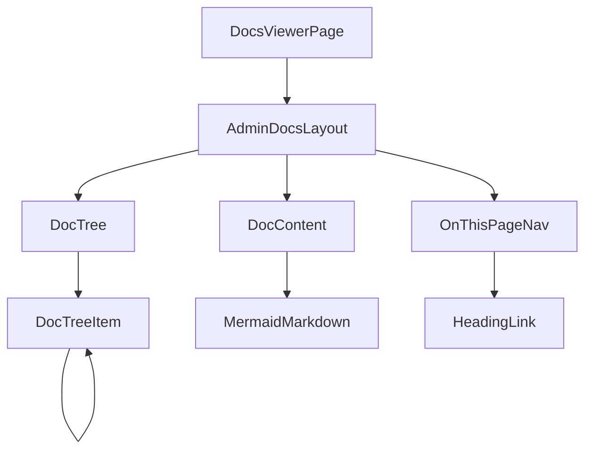

# React Components

Component architecture for the docs viewer UI.

---

## Component Hierarchy



---

## Components Overview

| Component | Purpose | Props |
|-----------|---------|-------|
| `DocsViewerPage` | Main page, data fetching | — |
| `AdminDocsLayout` | Three-column layout | `children` |
| `DocTree` | Recursive folder tree | `nodes`, `currentPath`, `onSelect` |
| `DocTreeItem` | Single tree node | `node`, `currentPath`, `onSelect` |
| `MermaidMarkdown` | Markdown + Mermaid | `content` |
| `OnThisPageNav` | TOC from headings | `content` |

---

## DocsViewerPage

Main page component that orchestrates data fetching and routing.

### Interface

```typescript
interface DocsViewerPageProps {
  basePath?: string;
}
```

### Responsibilities

1. Fetch docs tree on mount
2. Fetch content when path changes
3. Handle navigation
4. Render layout with components

### Data Fetching Patterns

**TanStack Query:**
```typescript
const { data: tree } = useQuery({
  queryKey: ['docs', 'tree'],
  queryFn: () => fetch('/admin/docs/tree').then(r => r.json()),
});

const { data: content } = useQuery({
  queryKey: ['docs', 'content', currentPath],
  queryFn: () => fetch(`/admin/docs/content/${currentPath}`).then(r => r.json()),
  enabled: !!currentPath,
});
```

**SWR:**
```typescript
const { data: tree } = useSWR('/admin/docs/tree', fetcher);
const { data: content } = useSWR(
  currentPath ? `/admin/docs/content/${currentPath}` : null,
  fetcher
);
```

**Native fetch:**
```typescript
const [tree, setTree] = useState<DocNode[]>([]);
const [content, setContent] = useState<DocContent | null>(null);

useEffect(() => {
  fetch('/admin/docs/tree')
    .then(r => r.json())
    .then(setTree);
}, []);

useEffect(() => {
  if (currentPath) {
    fetch(`/admin/docs/content/${currentPath}`)
      .then(r => r.json())
      .then(setContent);
  }
}, [currentPath]);
```

---

## AdminDocsLayout

Three-column layout wrapper.

### Interface

```typescript
interface AdminDocsLayoutProps {
  tree: React.ReactNode;
  content: React.ReactNode;
  toc?: React.ReactNode;
  layout?: 'three-column' | 'two-column' | 'single';
}
```

### CSS Structure

```css
.admin-docs-layout {
  display: flex;
  min-height: 100vh;
}

.admin-docs-layout__tree {
  width: 250px;
  flex-shrink: 0;
  border-right: 1px solid var(--border);
  overflow-y: auto;
}

.admin-docs-layout__content {
  flex: 1;
  padding: 2rem;
  overflow-y: auto;
}

.admin-docs-layout__toc {
  width: 200px;
  flex-shrink: 0;
  padding: 1rem;
  border-left: 1px solid var(--border);
  position: sticky;
  top: 0;
  height: 100vh;
  overflow-y: auto;
}

/* Two-column variant */
.admin-docs-layout--two-column .admin-docs-layout__toc {
  display: none;
}

/* Single-column variant */
.admin-docs-layout--single {
  flex-direction: column;
}

.admin-docs-layout--single .admin-docs-layout__tree {
  width: 100%;
  border-right: none;
  border-bottom: 1px solid var(--border);
}
```

---

## DocTree

Recursive tree navigation component.

### Interface

```typescript
interface DocNode {
  name: string;
  path: string;
  type: 'file' | 'folder';
  children?: DocNode[];
}

interface DocTreeProps {
  nodes: DocNode[];
  currentPath: string;
  onSelect: (path: string) => void;
}
```

### Implementation

```typescript
function DocTree({ nodes, currentPath, onSelect }: DocTreeProps) {
  return (
    <nav className="doc-tree" aria-label="Documentation navigation">
      <ul className="doc-tree__list">
        {nodes.map(node => (
          <DocTreeItem
            key={node.path}
            node={node}
            currentPath={currentPath}
            onSelect={onSelect}
          />
        ))}
      </ul>
    </nav>
  );
}
```

---

## DocTreeItem

Single tree node with expand/collapse for folders.

### Interface

```typescript
interface DocTreeItemProps {
  node: DocNode;
  currentPath: string;
  onSelect: (path: string) => void;
  depth?: number;
}
```

### Implementation

```typescript
function DocTreeItem({ node, currentPath, onSelect, depth = 0 }: DocTreeItemProps) {
  const isActive = currentPath === node.path;
  const isExpanded = currentPath.startsWith(node.path);
  const [expanded, setExpanded] = useState(isExpanded);

  const handleClick = () => {
    if (node.type === 'folder') {
      setExpanded(!expanded);
    } else {
      onSelect(node.path);
    }
  };

  return (
    <li className="doc-tree-item">
      <button
        className={cn(
          'doc-tree-item__button',
          isActive && 'doc-tree-item__button--active'
        )}
        onClick={handleClick}
        style={{ paddingLeft: `${depth * 12 + 8}px` }}
      >
        {node.type === 'folder' ? (
          <ChevronIcon expanded={expanded} />
        ) : (
          <FileIcon />
        )}
        <span className="doc-tree-item__name">
          {node.name.replace('.md', '')}
        </span>
      </button>

      {node.type === 'folder' && expanded && node.children && (
        <ul className="doc-tree-item__children">
          {node.children.map(child => (
            <DocTreeItem
              key={child.path}
              node={child}
              currentPath={currentPath}
              onSelect={onSelect}
              depth={depth + 1}
            />
          ))}
        </ul>
      )}
    </li>
  );
}
```

---

## MermaidMarkdown

Markdown renderer with Mermaid diagram support.

### Interface

```typescript
interface MermaidMarkdownProps {
  content: string;
  className?: string;
}
```

### Implementation with @uiw/react-markdown-preview

```typescript
import MarkdownPreview from '@uiw/react-markdown-preview';
import mermaid from 'mermaid';
import { useEffect, useRef } from 'react';

function MermaidMarkdown({ content, className }: MermaidMarkdownProps) {
  const containerRef = useRef<HTMLDivElement>(null);

  useEffect(() => {
    mermaid.initialize({ startOnLoad: false, theme: 'default' });
  }, []);

  useEffect(() => {
    if (containerRef.current) {
      const mermaidBlocks = containerRef.current.querySelectorAll('.language-mermaid');
      mermaidBlocks.forEach(async (block, index) => {
        const code = block.textContent || '';
        try {
          const { svg } = await mermaid.render(`mermaid-${index}`, code);
          block.innerHTML = svg;
        } catch (error) {
          console.error('[TLDOCS] Mermaid render error:', error);
        }
      });
    }
  }, [content]);

  return (
    <div ref={containerRef} className={className}>
      <MarkdownPreview source={content} />
    </div>
  );
}
```

### Implementation with react-markdown

```typescript
import ReactMarkdown from 'react-markdown';
import { Prism as SyntaxHighlighter } from 'react-syntax-highlighter';
import mermaid from 'mermaid';

function MermaidMarkdown({ content }: MermaidMarkdownProps) {
  return (
    <ReactMarkdown
      components={{
        code({ node, inline, className, children, ...props }) {
          const match = /language-(\w+)/.exec(className || '');
          const language = match ? match[1] : '';

          if (language === 'mermaid') {
            return <MermaidDiagram code={String(children)} />;
          }

          if (!inline && language) {
            return (
              <SyntaxHighlighter language={language} {...props}>
                {String(children).replace(/\n$/, '')}
              </SyntaxHighlighter>
            );
          }

          return <code className={className} {...props}>{children}</code>;
        },
      }}
    >
      {content}
    </ReactMarkdown>
  );
}

function MermaidDiagram({ code }: { code: string }) {
  const ref = useRef<HTMLDivElement>(null);

  useEffect(() => {
    if (ref.current) {
      mermaid.render('mermaid-' + Math.random(), code).then(({ svg }) => {
        ref.current!.innerHTML = svg;
      });
    }
  }, [code]);

  return <div ref={ref} className="mermaid-diagram" />;
}
```

---

## OnThisPageNav

Table of contents generated from markdown headings.

### Interface

```typescript
interface Heading {
  id: string;
  text: string;
  level: number;
}

interface OnThisPageNavProps {
  content: string;
  maxDepth?: number;
}
```

### Heading Extraction

```typescript
function extractHeadings(content: string, maxDepth = 3): Heading[] {
  const headings: Heading[] = [];
  const lines = content.split('\n');

  for (const line of lines) {
    const match = line.match(/^(#{2,4})\s+(.+)$/);
    if (match) {
      const level = match[1].length;
      if (level <= maxDepth + 1) {
        const text = match[2].trim();
        const id = text
          .toLowerCase()
          .replace(/[^\w\s-]/g, '')
          .replace(/\s+/g, '-');

        headings.push({ id, text, level });
      }
    }
  }

  return headings;
}
```

### Implementation

```typescript
function OnThisPageNav({ content, maxDepth = 3 }: OnThisPageNavProps) {
  const headings = extractHeadings(content, maxDepth);

  if (headings.length === 0) {
    return null;
  }

  return (
    <nav className="on-this-page" aria-label="On this page">
      <h4 className="on-this-page__title">On this page</h4>
      <ul className="on-this-page__list">
        {headings.map(heading => (
          <li
            key={heading.id}
            className="on-this-page__item"
            style={{ paddingLeft: `${(heading.level - 2) * 12}px` }}
          >
            <a href={`#${heading.id}`} className="on-this-page__link">
              {heading.text}
            </a>
          </li>
        ))}
      </ul>
    </nav>
  );
}
```

### CSS

```css
.on-this-page {
  font-size: 0.875rem;
}

.on-this-page__title {
  font-weight: 600;
  margin-bottom: 0.5rem;
  color: var(--text-muted);
  text-transform: uppercase;
  letter-spacing: 0.05em;
}

.on-this-page__list {
  list-style: none;
  padding: 0;
  margin: 0;
}

.on-this-page__item {
  margin: 0.25rem 0;
}

.on-this-page__link {
  color: var(--text-secondary);
  text-decoration: none;
  display: block;
  padding: 0.25rem 0;
}

.on-this-page__link:hover {
  color: var(--text-primary);
}
```

---

## Dark Mode Support

Add CSS custom properties for theme support:

```css
:root {
  --bg-primary: #ffffff;
  --bg-secondary: #f8f9fa;
  --text-primary: #1a1a1a;
  --text-secondary: #6b7280;
  --text-muted: #9ca3af;
  --border: #e5e7eb;
}

[data-theme='dark'] {
  --bg-primary: #1a1a1a;
  --bg-secondary: #2d2d2d;
  --text-primary: #ffffff;
  --text-secondary: #a1a1aa;
  --text-muted: #71717a;
  --border: #3f3f46;
}
```

For Mermaid, detect theme:

```typescript
const theme = document.documentElement.getAttribute('data-theme');
mermaid.initialize({
  startOnLoad: false,
  theme: theme === 'dark' ? 'dark' : 'default',
});
```
