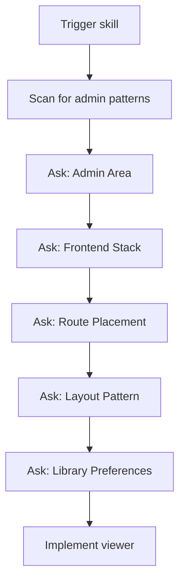
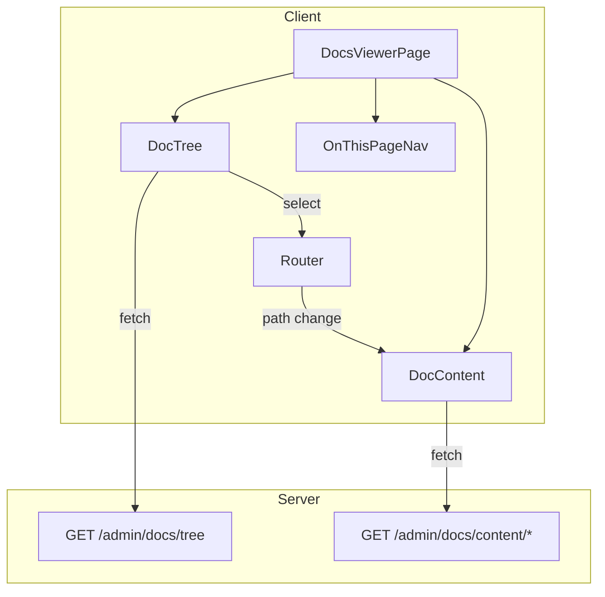

# Documentation Viewer UI

Create a browseable documentation viewer for admin interfaces with tree navigation, markdown rendering, and Mermaid diagram support.

## When to Use

- "create docs viewer"
- "add documentation browser"
- "admin docs UI"
- "browse docs folder"
- "docs viewer component"
- Adding a docs/ browser to an existing admin area
- Need to view markdown documentation in-app

## Outcomes

- **Artifact**: React page component with three-column layout (tree + content + TOC)
- **Artifact**: Server API endpoints for tree and content
- **Artifact**: Supporting components (DocTree, MermaidMarkdown, OnThisPageNav)
- **Decision**: Route placement and library choices

---

## Configuration Discovery

Before implementation, gather project context through structured questions. See `references/configuration.md` for full schemas.

### Question Flow



### Questions Summary

1. **Admin Area Detection** — Existing admin area? (yes/no/scan)
2. **Frontend Stack** — React Router / Wouter / Next.js / TanStack Router / Remix
3. **Route Placement** — Detected path / /admin/docs / /docs / custom
4. **Layout Pattern** — Three-column / Two-column / Single column
5. **Library Preferences** — Markdown renderer + data fetching choices

---

## Architecture

### Three-Column Layout (Default)

```
┌─────────────────────────────────────────────────────────────┐
│                    Admin Docs Layout                        │
├──────────┬───────────────────────────────────┬──────────────┤
│          │                                   │              │
│  DocTree │         DocContent                │ OnThisPage   │
│  (250px) │         (flex-1)                  │ (200px)      │
│          │                                   │              │
│  ├─ docs │  # Document Title                 │ - Section 1  │
│  │  ├─ a │                                   │ - Section 2  │
│  │  └─ b │  Content rendered from markdown   │   - Sub 2.1  │
│  └─ ...  │                                   │ - Section 3  │
│          │                                   │              │
└──────────┴───────────────────────────────────┴──────────────┘
```

### Data Flow



---

## Phase 1: Server API

Create two endpoints. See `references/server-api.md` for full patterns.

### GET /admin/docs/tree

Returns folder structure as JSON tree.

```typescript
interface DocNode {
  name: string;
  path: string;
  type: 'file' | 'folder';
  children?: DocNode[];
}
```

### GET /admin/docs/content/:path*

Returns markdown content and metadata.

```typescript
interface DocContent {
  content: string;
  title: string;
  lastUpdated?: string;
  path: string;
}
```

---

## Phase 2: React Components

Create the component hierarchy. See `references/react-components.md` for full architecture.

### Components

| Component | Purpose |
|-----------|---------|
| `AdminDocsLayout` | Three-column layout wrapper |
| `DocTree` | Recursive tree navigation |
| `DocTreeItem` | Single tree node with expand/collapse |
| `MermaidMarkdown` | Markdown renderer with Mermaid support |
| `OnThisPageNav` | TOC generated from headings |

---

## Phase 3: Integration

### Route Setup

Based on detected frontend stack:

| Stack | Route Pattern |
|-------|---------------|
| React Router | `<Route path="/admin/docs/*" element={<DocsViewer />} />` |
| Wouter | `<Route path="/admin/docs/:path*" component={DocsViewer} />` |
| Next.js | `app/admin/docs/[[...path]]/page.tsx` |
| TanStack Router | `createRoute({ path: '/admin/docs/$path', component: DocsViewer })` |

### Data Fetching

Based on library preference:

| Library | Pattern |
|---------|---------|
| TanStack Query | `useQuery({ queryKey: ['docs', 'tree'], queryFn: fetchTree })` |
| SWR | `useSWR('/admin/docs/tree', fetcher)` |
| Native fetch | `useEffect` + `useState` pattern |

---

## Dependencies

Configurable via AskQuestion:

| Category | Default | Alternatives |
|----------|---------|--------------|
| Markdown | @uiw/react-markdown-preview | react-markdown, marked |
| Data fetching | @tanstack/react-query | swr, native fetch |
| Diagrams | mermaid | Optional |

---

## Verification

After implementation, verify:

- [ ] Tree loads and displays folder structure
- [ ] Clicking file loads markdown content
- [ ] Mermaid diagrams render (if enabled)
- [ ] TOC generates from headings
- [ ] Route navigation works
- [ ] Dark mode supported (if applicable)

---

## References

| File | Purpose |
|------|---------|
| `references/configuration.md` | AskQuestion flows and branching |
| `references/server-api.md` | API endpoint patterns |
| `references/react-components.md` | Component architecture |
| `references/templates/` | Code templates |

---

## Related Skills

- **tl-docs-create-review** — Create and maintain documentation content (same suite)
