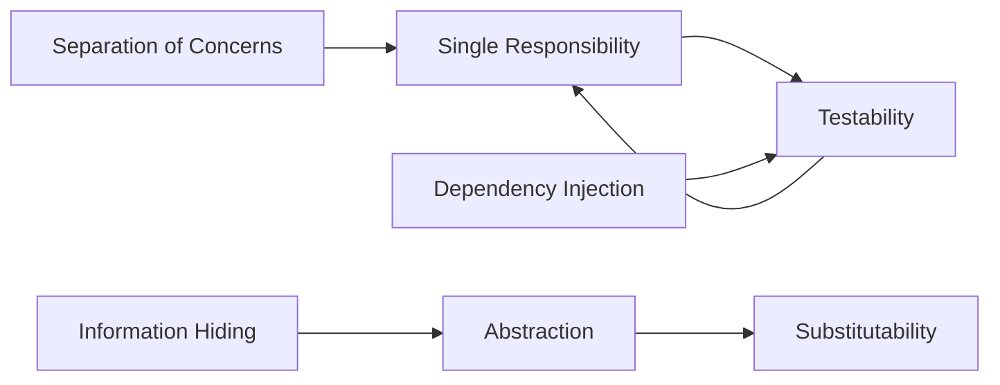

<!-- Copyright (c) 2026 Todd Levy. Licensed under MIT. SPDX-License-Identifier: MIT -->

# First Principles of Software Design

The foundational axioms of quality software, traced to their intellectual origins.

**"First Principles"** carries a deliberate double meaning:

1. **Epistemological** — Reasoning from irreducible truths rather than by analogy
2. **Historical** — The *first* people who articulated these principles; the founders

This skill provides the *why* behind best practices by connecting modern conventions to their intellectual lineage.

## When to Use

- Making architectural decisions with trade-offs
- Evaluating whether code violates design principles
- Understanding *why* a pattern exists, not just *how*
- Teaching or explaining software design
- Code review with principled reasoning

## Principles Index

| Principle | Founder(s) | Key Work | Link |
|-----------|------------|----------|------|
| [Information Hiding](principles/information-hiding.md) | Parnas | 1972 | Decompose by secrets |
| [Separation of Concerns](principles/separation-of-concerns.md) | Dijkstra | 1974 | One thing at a time |
| [Abstraction & Contracts](principles/abstraction-contracts.md) | Liskov, Hoare | 1974, 1969 | Interfaces as promises |
| [Single Source of Truth](principles/single-source-of-truth.md) | Hunt & Thomas | 1999 | Every fact once |
| [Conceptual Integrity](principles/conceptual-integrity.md) | Brooks | 1975 | One coherent vision |
| [Fail Fast](principles/fail-fast.md) | Hamilton, Shore | 1960s, 2004 | Early detection |
| [Composition Over Inheritance](principles/composition-over-inheritance.md) | GoF | 1994 | Flexible assembly |
| [Explicit Over Implicit](principles/explicit-over-implicit.md) | Peters | 1999 | Clarity always |

## Founders Index

| Name | Era | Primary Contribution | Link |
|------|-----|---------------------|------|
| [David Parnas](founders/parnas.md) | 1970s | Modularity, information hiding |
| [Edsger Dijkstra](founders/dijkstra.md) | 1960s-70s | Structured programming, SoC |
| [Barbara Liskov](founders/liskov.md) | 1970s-90s | Data abstraction, substitutability |
| [C.A.R. Hoare](founders/hoare.md) | 1960s-70s | Contracts, formal reasoning |
| [Frederick Brooks](founders/brooks.md) | 1970s | Conceptual integrity, system design |
| [Margaret Hamilton](founders/hamilton.md) | 1960s | Software engineering, reliability |
| [Andy Hunt & Dave Thomas](founders/hunt-thomas.md) | 1990s | DRY, pragmatic practice |
| [Gang of Four](founders/gang-of-four.md) | 1990s | Design patterns |

## How to Use This Skill

### For Decision-Making

When evaluating a design choice, identify which principles are at stake:

```
"Should we duplicate this validation logic in both services?"

→ Principle: Single Source of Truth (Hunt & Thomas)
→ Risk: Drift when one copy changes but the other doesn't
→ Decision: Extract to shared module or single service
```

### For Code Review

Cite the principle and its lineage when explaining why something matters:

```
"This component fetches data AND renders AND handles errors.
 That's three concerns in one place.

→ Principle: Separation of Concerns (Dijkstra, 1974)
→ Why it matters: Each concern changes for different reasons
→ Suggestion: Extract data fetching to a hook"
```

### For Learning

Trace modern patterns back to their origins:

```
React hooks → Composition over Inheritance → GoF (1994)
TypeScript interfaces → Contracts → Hoare (1969), Liskov (1987)
Redux single store → SSOT → Hunt & Thomas (1999)
Microservices → Information Hiding → Parnas (1972)
```

## Convergence Map

These principles emerged from different lineages but converge on the same goal: **managing complexity in systems that must change over time**.

```
                         ┌─────────────────────────────────────┐
                         │   MANAGING COMPLEXITY IN SYSTEMS    │
                         │       THAT MUST CHANGE OVER TIME    │
                         └───────────────┬─────────────────────┘
                                         │
          ┌──────────────┬───────────────┼───────────────┬──────────────┐
          â–¼              â–¼               â–¼               â–¼              â–¼
   ┌─────────────┐ ┌───────────┐ ┌─────────────┐ ┌─────────────┐ ┌──────────┐
   │ MODULARITY  │ │ LEGIBILITY│ │ ABSTRACTION │ │  INTEGRITY  │ │ FEEDBACK │
   │   Parnas    │ │  Dijkstra │ │Liskov/Hoare │ │   Brooks    │ │ Hamilton │
   └─────────────┘ └───────────┘ └─────────────┘ └─────────────┘ └──────────┘
          │              │               │               │              │
          â–¼              â–¼               â–¼               â–¼              â–¼
   Information     Separation      Contracts &     Conceptual      Fail Fast
     Hiding        of Concerns    Substitution      Integrity
          │              │               │               │              │
          └──────────────┴───────────────┴───────────────┴──────────────┘
                                         │
                         ┌───────────────┼───────────────┐
                         â–¼               â–¼               â–¼
                  ┌─────────────┐ ┌─────────────┐ ┌─────────────┐
                  │    SOLID    │ │     DRY     │ │   PATTERNS  │
                  │ Uncle Bob   │ │ Hunt/Thomas │ │     GoF     │
                  └─────────────┘ └─────────────┘ └─────────────┘
                         │               │               │
                         └───────────────┼───────────────┘
                                         â–¼
                         ┌─────────────────────────────────────┐
                         │        MODERN PRACTICE              │
                         │  Clean Architecture, Microservices, │
                         │  Functional Core, React Composition │
                         └─────────────────────────────────────┘
```

## Primary Sources

See [sources/primary-sources.md](sources/primary-sources.md) for annotated bibliography with links to original papers and books.

---

## Decision Heuristics

When principles appear to conflict, use these heuristics:

### Information Hiding vs Explicitness

| Choose Information Hiding | Choose Explicitness |
|---------------------------|---------------------|
| Implementation will change | Interface is the value |
| Multiple consumers | Single-use utility |
| Encapsulation aids testing | Debugging requires visibility |

### SRP vs DRY

| Choose SRP (accept duplication) | Choose DRY (accept coupling) |
|---------------------------------|------------------------------|
| Code changes for different reasons | Code truly represents one concept |
| Teams own different copies | Central ownership is clear |
| Coupling cost > duplication cost | Duplication cost > coupling cost |

### YAGNI vs Extensibility

| Choose YAGNI (build less) | Choose Extensibility (build hooks) |
|---------------------------|-----------------------------------|
| Uncertain requirements | Known variation points |
| Prototype or MVP | Library or framework |
| Single consumer | Multiple consumers |

### Scale Considerations

| Context | Principle Emphasis |
|---------|-------------------|
| Solo developer | Conceptual Integrity (one mind) |
| Team | Separation of Concerns (parallel work) |
| Prototype | YAGNI, Fail Fast |
| Production | Information Hiding, Contracts |
| Library | Liskov Substitution, Stable APIs |
| Application | Composition, Flexibility |

---

## Anti-Pattern Catalog

| Anti-Pattern | Violated Principle | Consequence |
|--------------|-------------------|-------------|
| **God Object** | SRP | Changes ripple everywhere; untestable |
| **Leaky Abstraction** | Information Hiding | Consumers depend on implementation details |
| **Shotgun Surgery** | SoC | One change requires editing many files |
| **Primitive Obsession** | Abstraction | Scattered validation; unclear semantics |
| **Feature Envy** | Information Hiding | Method uses another object's data more than its own |
| **Divergent Change** | SRP | One class changes for multiple unrelated reasons |
| **Parallel Inheritance** | Composition | Adding one class requires adding another |
| **Dead Code** | Explicit over Implicit | Confusion about what's active |
| **Speculative Generality** | YAGNI | Complexity for unused flexibility |
| **Inappropriate Intimacy** | Information Hiding | Classes know too much about each other |

### Diagnostic Questions

- **Does this change for multiple reasons?** → SRP violation
- **Could I swap this implementation?** → Information Hiding check
- **Is this fact represented once?** → DRY/SSOT check
- **Can I test this in isolation?** → Coupling smell
- **Does the name explain the purpose?** → Abstraction quality

---

## Principle Interactions

### Reinforcing Relationships



### Tension Relationships

| Tension | Resolution |
|---------|------------|
| DRY ↔ Coupling | Accept duplication when coupling is worse |
| YAGNI ↔ Extensibility | Build for known requirements only |
| Explicitness ↔ Hiding | Hide implementation, expose intent |
| Performance ↔ Abstraction | Optimize measured bottlenecks only |

---

## Related Skills

This skill provides the *theory*. For *practice*, see:

| Need | Skill |
|------|-------|
| Database patterns | `drizzle-patterns` |
| Code quality setup | `code-quality-setup` |
| Codebase audit | `codebase-audit` |
| Complexity assessment | `tl-complexity-assessment` |

---

## References

### Quilted Skills

- [sickn33/software-architecture](https://skills.sh/sickn33/antigravity-awesome-skills/software-architecture) — Architecture patterns
- [athola/code-quality-principles](https://skills.sh/athola/claude-night-market/code-quality-principles) — KISS, YAGNI
- [ramziddin/solid-skills](https://github.com/ramziddin/solid-skills) — SOLID principles

### First-Party Academic Sources

- [Parnas 1972 — On the Criteria To Be Used in Decomposing Systems into Modules](https://dl.acm.org/doi/10.1145/361598.361623)
- [Dijkstra — On the Role of Scientific Thought (EWD447)](https://www.cs.utexas.edu/~EWD/transcriptions/EWD04xx/EWD447.html)
- [Liskov 1987 — Data Abstraction and Hierarchy](https://dl.acm.org/doi/10.1145/942572.807045)
- [Brooks 1975 — The Mythical Man-Month](https://www.oreilly.com/library/view/mythical-man-month-the/0201835959/)

### Modern Interpretation

- [Martin Fowler's Bliki](https://martinfowler.com/bliki/) — Contemporary patterns
- [Clean Coder Blog](https://blog.cleancoder.com/) — Robert Martin on SOLID
- [Refactoring.Guru](https://refactoring.guru/design-patterns) — Pattern explanations

### Books

- [Clean Architecture (Martin)](https://www.oreilly.com/library/view/clean-architecture-a/9780134494272/)
- [Domain-Driven Design (Evans)](https://www.oreilly.com/library/view/domain-driven-design-tackling/0321125215/)
- [Patterns of Enterprise Application Architecture (Fowler)](https://www.oreilly.com/library/view/patterns-of-enterprise/0321127420/)

### Skill References

- [sources/primary-sources.md](sources/primary-sources.md) — Annotated bibliography
- [principles/](principles/) — Individual principle deep-dives
- [founders/](founders/) — Biographical context for key figures
