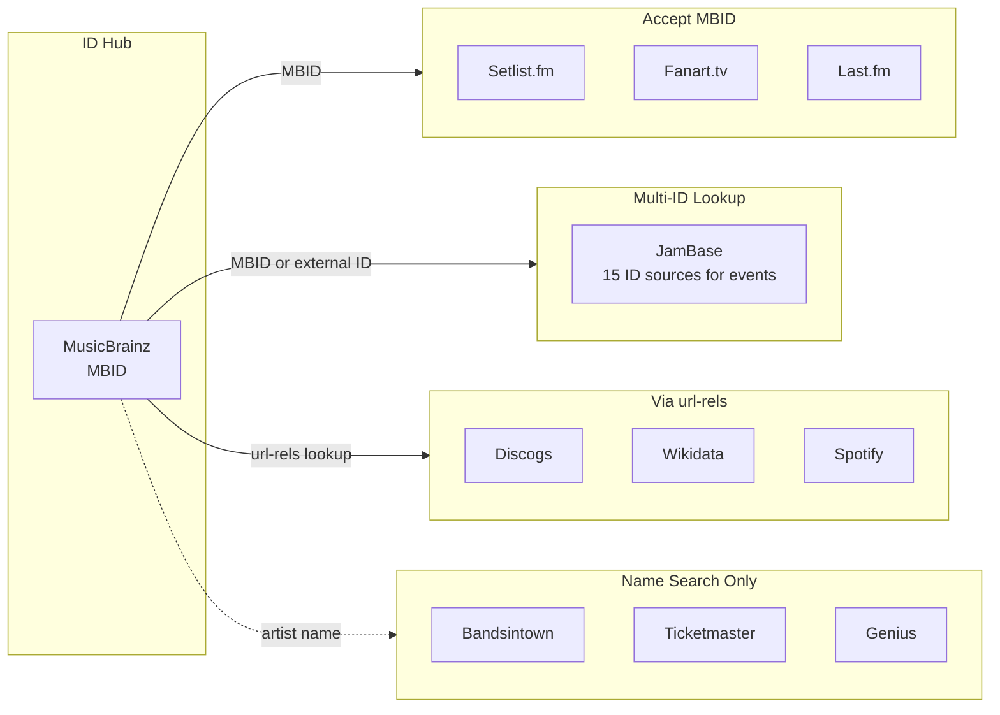

<!-- Copyright (c) 2026 Todd Levy. Licensed under MIT. SPDX-License-Identifier: MIT -->

# Live Music Data APIs

Reference documentation for live music data APIs and how they connect via external IDs. Covers artist metadata, concert events, setlists, and images across multiple providers.

## When to Use

- "How do I get concert data for an artist?"
- "Which API should I use for setlists?"
- "Where can I get music livestream data?"
- "How do I resolve artist IDs across platforms?"
- Building applications that need artist metadata, concert events, livestreams, or setlists
- Resolving artist identities across multiple platforms
- Integrating live music data APIs

## Outcomes

- **Analysis**: API selection based on data requirements
- **Reference**: Endpoint documentation, auth patterns, rate limits
- **Decision**: ID resolution strategy (MBID hub vs name search)

---

## API Quick Reference

### Tier 1: Core APIs (High Value, Easy Access)

| API | Auth | Rate Limit | Primary Use | Reference |
|-----|------|------------|-------------|-----------|
| **MusicBrainz** | User-Agent | 1 req/sec | ID hub, external IDs, releases | [musicbrainz.md](references/musicbrainz.md) |
| **Setlist.fm** | API key | Undocumented | Setlists, song data | [setlistfm.md](references/setlistfm.md) |
| **Wikidata** | None | Reasonable | Cross-references, SPARQL | [wikidata.md](references/wikidata.md) |
| **Discogs** | User-Agent | 60/min auth | Discography, releases | [discogs.md](references/discogs.md) |
| **nugs.net** | None | ~2/sec | Live recordings catalog | [nugs.md](references/nugs.md) |

### Tier 2: Events and Concerts

| API | Auth | Rate Limit | Primary Use | Reference |
|-----|------|------------|-------------|-----------|
| **JamBase** | Bearer token | 3,600–120,000/hour (plan-tiered) | Most comprehensive events + Streams | [jambase.md](references/jambase.md) |
| **Songkick** | API key | Undocumented | Gigography (KEYS SUSPENDED) | [songkick.md](references/songkick.md) |
| **Bandsintown** | App ID | Undocumented | Artist events, tour dates | [bandsintown.md](references/bandsintown.md) |
| **Ticketmaster** | API key | 5,000/day | Events, venues, tickets | [ticketmaster.md](references/ticketmaster.md) |

### Tier 3: Supplementary Data

| API | Auth | Rate Limit | Primary Use | Reference |
|-----|------|------------|-------------|-----------|
| **Last.fm** | API key | Soft limit | Similar artists, tags | [lastfm.md](references/lastfm.md) |
| **Fanart.tv** | API key | Undocumented | High-res artwork (needs MBID) | [fanarttv.md](references/fanarttv.md) |
| **TheAudioDB** | API key | 2/sec free | Metadata, images | [theaudiodb.md](references/theaudiodb.md) |
| **Genius** | OAuth 2.0 | Undocumented | Song annotations (no lyrics) | [genius.md](references/genius.md) |

### Tier 4: Avoid / Difficult Access

| API | Issue |
|-----|-------|
| **AllMusic** | No public API - scraping only |
| **IMDB** | AWS Data Exchange subscription required |
| **Spotify** | Requires app review for production |

### Web Scraping Fallback

When APIs are unavailable (Tier 4) or rate-limited, use web scraping as a fallback. **Workflow escalation**: search → scrape → crawl.

```bash
# Scrape a single artist page to markdown
firecrawl scrape "https://www.allmusic.com/artist/mn0000004789" --only-main-content -o .firecrawl/artist.md

# Wait for JS rendering (SPA sites)
firecrawl scrape "<url>" --wait-for 3000 -o .firecrawl/page.md

# Extract structured data with a query
firecrawl scrape "https://example.com/artist" --query "What are the upcoming tour dates?"
```

**Best practices for music data scraping**:
- Respect `robots.txt` and rate limit aggressively (1-2 req/sec)
- Cache scraped content for 7+ days
- Prefer APIs when available - scraping breaks when sites change
- Use `--only-main-content` to skip navigation/ads

See [firecrawl/cli skills](https://skills.sh/firecrawl/cli) for comprehensive scraping patterns.

---

## ID Mapping Architecture

MusicBrainz serves as the central ID hub. Most services either accept MBID directly or can be resolved via MusicBrainz url-rels.



### Services That Accept MBID Directly

| Service | Endpoint Pattern |
|---------|-----------------|
| Setlist.fm | `/artist/{mbid}/setlists` |
| Fanart.tv | `/music/{mbid}` |
| Last.fm | `?method=artist.getInfo&mbid={mbid}` |
| JamBase | `/v3/artists/id/musicbrainz:{mbid}` |
| TheAudioDB | `/artist-mb.php?i={mbid}` (Premium only) |

### Services Requiring url-rels Lookup

Get external IDs from MusicBrainz first:

```
GET /ws/2/artist/{mbid}?inc=url-rels&fmt=json
```

Returns IDs for: spotify, discogs, wikidata, allmusic, lastfm, imdb, bandcamp, soundcloud, youtube

### JamBase Multi-ID Support

JamBase v3 accepts different source slugs per resource. Use `{source}:{id}` everywhere an ID is accepted.

**Events (15 sources)**:
`axs`, `dice`, `etix`, `eventbrite`, `eventim-de`, `jambase`, `seated`, `seatgeek`, `see-tickets`, `see-tickets-uk`, `sofar-sounds`, `suitehop`, `ticketmaster`, `tixr`, `viagogo`

**Artists (12 sources)**:
`axs`, `dice`, `etix`, `eventbrite`, `eventim-de`, `jambase`, `musicbrainz`, `seated`, `seatgeek`, `spotify`, `ticketmaster`, `viagogo`

**Venues (11 sources)**:
`axs`, `dice`, `etix`, `eventbrite`, `eventim-de`, `jambase`, `seated`, `seatgeek`, `suitehop`, `ticketmaster`, `viagogo`

**Streams**: `jambase` only (as of v3.0.0).

```
/v3/events/id/{source}:{id}
/v3/artists/id/{source}:{id}
/v3/venues/id/{source}:{id}
```

---

## Environment Variables

```bash
# Tier 1
MUSICBRAINZ_USER_AGENT="AppName/1.0 (contact@example.com)"
SETLISTFM_API_KEY=""
DISCOGS_TOKEN=""

# Tier 2
JAMBASE_API_KEY=""
SONGKICK_API_KEY=""
BANDSINTOWN_APP_ID=""
TICKETMASTER_API_KEY=""

# Tier 3
LASTFM_API_KEY=""
FANARTTV_API_KEY=""
THEAUDIODB_API_KEY=""
GENIUS_ACCESS_TOKEN=""
```

---

## API Selection Guide

| Need | Recommended API |
|------|----------------|
| Artist identity resolution | MusicBrainz (as hub) |
| Live events/concerts | JamBase (most comprehensive) |
| Music livestreams | JamBase (Streams) |
| Historical setlists | Setlist.fm |
| Artist images | Fanart.tv (if have MBID) or TheAudioDB |
| Similar artists | Last.fm |
| Discography | Discogs |
| Song metadata | Genius |
| Live recordings | nugs.net |

---

## ID Resolution Strategy

### Starting with Artist Name

1. Search MusicBrainz for MBID
2. Use MBID to get external IDs via url-rels
3. Use external IDs with other services

### Starting with Existing ID (Spotify, etc.)

1. Use JamBase `/v3/artists/id/{source}:{id}` for direct lookup
2. Or lookup in Wikidata via property (P1902 for Spotify)
3. Resolve to MBID for other services

---

## Rate Limit Summary

| API | Strategy |
|-----|----------|
| MusicBrainz | `sleep(1000)` between requests |
| Discogs | Monitor `X-Discogs-Ratelimit-Remaining` header |
| JamBase | 3,600/hr (Trial/Dev) → 120,000+/hr (Enterprise); honor IETF `RateLimit` headers |
| Ticketmaster | 5,000/day = throttle during batch |
| TheAudioDB | `sleep(500)` between requests |

---

## OAuth 2.0 Patterns

> See [OAuth 2.0 Patterns](references/oauth-patterns.md) for the full Spotify Authorization Code + PKCE flow, the token refresh pattern, and recommended scopes per provider.

---

## Pagination Patterns

> See [Pagination Patterns](references/pagination-patterns.md) for cursor-based vs offset-based async iterators and the per-API pagination parameter table.

---

## Error Handling Matrix

> See [Error Handling](references/error-handling.md) for the full retry strategy table by HTTP code, the `fetchWithRetry` implementation, and API-specific error code interpretations.

---

## Caching Recommendations

| Data Type | TTL |
|-----------|-----|
| Artist metadata | 7 days |
| Event listings | 1-4 hours |
| Setlists | 7-30 days |
| Images/artwork | 30+ days |
| External IDs | 30+ days |

---

## Local Data Architecture

> See [Local Data Architecture](references/local-data-architecture.md) for replica decision criteria, the external-ID-mapping schema (entities, entity_source_ids, sync_state), incremental sync patterns with overlap windows, ID resolution flow, the enrichment pipeline, and deletion/merge handling.

---

## Detailed Reference Files

Each API has comprehensive documentation in the `references/` folder:

- [musicbrainz.md](references/musicbrainz.md) - ID hub, url-rels, search, rate limiting
- [setlistfm.md](references/setlistfm.md) - Setlist search, MBID integration, response schemas
- [jambase.md](references/jambase.md) - v3 events, streams, venues, artists, geographies, lookups, multi-source ID
- [discogs.md](references/discogs.md) - Discography, releases, rate headers
- [wikidata.md](references/wikidata.md) - SPARQL queries, property codes
- [nugs.md](references/nugs.md) - Undocumented API, catalog methods
- [bandsintown.md](references/bandsintown.md) - Artist events, date filters
- [ticketmaster.md](references/ticketmaster.md) - Events, attractions, venues
- [songkick.md](references/songkick.md) - Gigography, calendar (keys suspended)
- [lastfm.md](references/lastfm.md) - Similar artists, tags, scrobbles
- [fanarttv.md](references/fanarttv.md) - High-res images via MBID
- [theaudiodb.md](references/theaudiodb.md) - Metadata, images, free vs premium
- [genius.md](references/genius.md) - Annotations, OAuth, no lyrics via API

---

## Skill Maintenance

### Keeping References Current

Each reference file includes a "Keeping Current" section with:
- **Authoritative docs** - Official documentation links
- **Version detection** - How to check for API changes
- **Test endpoint** - Quick verification command
- **Last verified** - When this reference was last validated

### Monitoring for Changes

| Check | Frequency | Method |
|-------|-----------|--------|
| Test endpoints | Weekly | Automated health checks |
| Documentation links | Monthly | Link validation |
| Version numbers | Monthly | Check API responses |
| Changelog reviews | Monthly | Visit official changelogs |

### Update Triggers

Re-verify a reference when:
- API returns unexpected errors
- New features announced in changelog
- Response structure differs from documented
- Rate limits or auth requirements change

### Contribution

To update this skill:
1. Verify changes against official docs
2. Test endpoints with real API calls
3. Update "Last Verified" date
4. Note breaking changes prominently

---

## References

### Quilted Skills
- [firecrawl/cli/firecrawl-scrape](https://skills.sh/firecrawl/cli/firecrawl-scrape) — Web scraping patterns

### First-Party API Documentation
- [MusicBrainz API](https://musicbrainz.org/doc/MusicBrainz_API) — ID hub, url-rels, JSON responses
- [MusicBrainz JSON Web Service](https://musicbrainz.org/doc/MusicBrainz_API/JSON) — JSON format details
- [Setlist.fm API](https://api.setlist.fm/docs/1.0/index.html) — Setlist search and retrieval
- [JamBase Data API Reference](https://data.jambase.com/api/reference) — v3 events, streams, venues, artists, geographies, lookups
- [JamBase Data llms-full.txt](https://data.jambase.com/llms-full.txt) — full LLM-tuned reference
- [JamBase Data OpenAPI 3.1](https://data.jambase.com/openapi.json) — versioned spec
- [JamBase Data ai-plugin.json](https://data.jambase.com/.well-known/ai-plugin.json) — discoverable plugin manifest
- [Ticketmaster Discovery API](https://developer.ticketmaster.com/products-and-docs/apis/discovery-api/v2/) — Events, attractions
- [Spotify Web API](https://developer.spotify.com/documentation/web-api) — OAuth 2.0, artist data
- [Spotify Authorization Guide](https://developer.spotify.com/documentation/web-api/tutorials/code-pkce-flow) — PKCE flow
- [Discogs API](https://www.discogs.com/developers) — Discography, releases
- [Last.fm API](https://www.last.fm/api) — Similar artists, tags
- [Wikidata Query Service](https://query.wikidata.org/) — SPARQL cross-references

### Community Resources
- [MusicBrainz Picard Documentation](https://picard-docs.musicbrainz.org/) — Tagging patterns
- [Wikidata SPARQL Examples](https://www.wikidata.org/wiki/Wikidata:SPARQL_query_service/queries/examples) — Cross-reference queries
