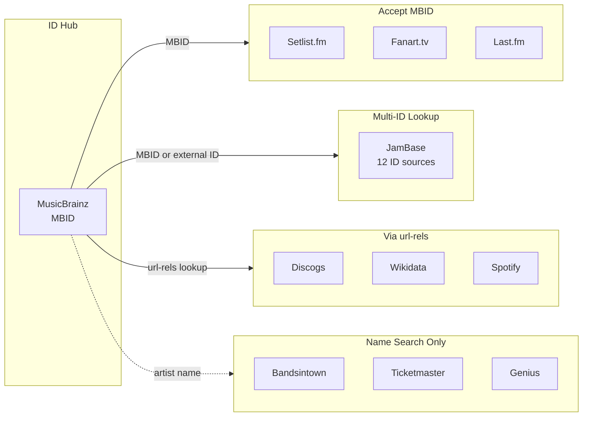
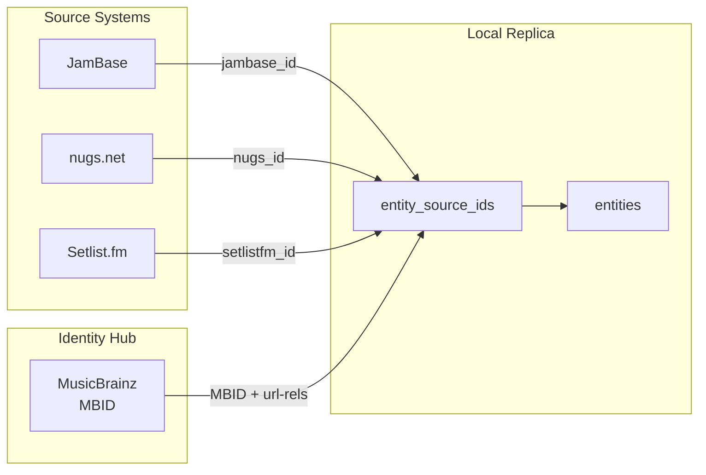
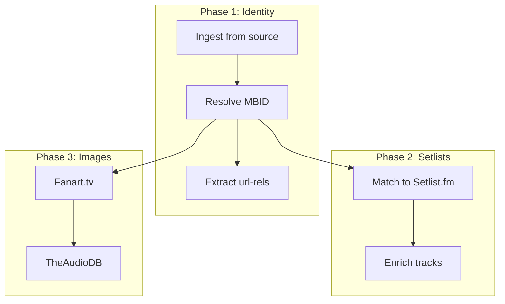

# Live Music Data APIs

Reference documentation for live music data APIs and how they connect via external IDs. Covers artist metadata, concert events, setlists, and images across multiple providers.

## When to Use

- "How do I get concert data for an artist?"
- "Which API should I use for setlists?"
- "How do I resolve artist IDs across platforms?"
- Building applications that need artist metadata, concert events, or setlists
- Resolving artist identities across multiple platforms
- Integrating live music data APIs

## Outcomes

- **Analysis**: API selection based on data requirements
- **Reference**: Endpoint documentation, auth patterns, rate limits
- **Decision**: ID resolution strategy (MBID hub vs name search)

---

## API Quick Reference

### Tier 1: Core APIs (High Value, Easy Access)

| API | Auth | Rate Limit | Primary Use | Reference |
|-----|------|------------|-------------|-----------|
| **MusicBrainz** | User-Agent | 1 req/sec | ID hub, external IDs, releases | [musicbrainz.md](references/musicbrainz.md) |
| **Setlist.fm** | API key | Undocumented | Setlists, song data | [setlistfm.md](references/setlistfm.md) |
| **Wikidata** | None | Reasonable | Cross-references, SPARQL | [wikidata.md](references/wikidata.md) |
| **Discogs** | User-Agent | 60/min auth | Discography, releases | [discogs.md](references/discogs.md) |
| **nugs.net** | None | ~2/sec | Live recordings catalog | [nugs.md](references/nugs.md) |

### Tier 2: Events and Concerts

| API | Auth | Rate Limit | Primary Use | Reference |
|-----|------|------------|-------------|-----------|
| **JamBase** | API key | 3,600/hour | Most comprehensive events | [jambase.md](references/jambase.md) |
| **Songkick** | API key | Undocumented | Gigography (KEYS SUSPENDED) | [songkick.md](references/songkick.md) |
| **Bandsintown** | App ID | Undocumented | Artist events, tour dates | [bandsintown.md](references/bandsintown.md) |
| **Ticketmaster** | API key | 5,000/day | Events, venues, tickets | [ticketmaster.md](references/ticketmaster.md) |

### Tier 3: Supplementary Data

| API | Auth | Rate Limit | Primary Use | Reference |
|-----|------|------------|-------------|-----------|
| **Last.fm** | API key | Soft limit | Similar artists, tags | [lastfm.md](references/lastfm.md) |
| **Fanart.tv** | API key | Undocumented | High-res artwork (needs MBID) | [fanarttv.md](references/fanarttv.md) |
| **TheAudioDB** | API key | 2/sec free | Metadata, images | [theaudiodb.md](references/theaudiodb.md) |
| **Genius** | OAuth 2.0 | Undocumented | Song annotations (no lyrics) | [genius.md](references/genius.md) |

### Tier 4: Avoid / Difficult Access

| API | Issue |
|-----|-------|
| **AllMusic** | No public API - scraping only |
| **IMDB** | AWS Data Exchange subscription required |
| **Spotify** | Requires app review for production |

### Web Scraping Fallback

When APIs are unavailable (Tier 4) or rate-limited, use web scraping as a fallback. **Workflow escalation**: search → scrape → crawl.

```bash
# Scrape a single artist page to markdown
firecrawl scrape "https://www.allmusic.com/artist/mn0000004789" --only-main-content -o .firecrawl/artist.md

# Wait for JS rendering (SPA sites)
firecrawl scrape "<url>" --wait-for 3000 -o .firecrawl/page.md

# Extract structured data with a query
firecrawl scrape "https://example.com/artist" --query "What are the upcoming tour dates?"
```

**Best practices for music data scraping**:
- Respect `robots.txt` and rate limit aggressively (1-2 req/sec)
- Cache scraped content for 7+ days
- Prefer APIs when available - scraping breaks when sites change
- Use `--only-main-content` to skip navigation/ads

See [firecrawl/cli skills](https://skills.sh/firecrawl/cli) for comprehensive scraping patterns.

---

## ID Mapping Architecture

MusicBrainz serves as the central ID hub. Most services either accept MBID directly or can be resolved via MusicBrainz url-rels.



### Services That Accept MBID Directly

| Service | Endpoint Pattern |
|---------|-----------------|
| Setlist.fm | `/artist/{mbid}/setlists` |
| Fanart.tv | `/music/{mbid}` |
| Last.fm | `?method=artist.getInfo&mbid={mbid}` |
| JamBase | `/artists/id/musicbrainz:{mbid}` |
| TheAudioDB | `/artist-mb.php?i={mbid}` (Premium only) |

### Services Requiring url-rels Lookup

Get external IDs from MusicBrainz first:

```
GET /ws/2/artist/{mbid}?inc=url-rels&fmt=json
```

Returns IDs for: spotify, discogs, wikidata, allmusic, lastfm, imdb, bandcamp, soundcloud, youtube

### JamBase Multi-ID Support

JamBase accepts 12 different ID sources:

```
/artists/id/{source}:{id}

Sources: jambase, musicbrainz, spotify, ticketmaster, seatgeek, 
         eventbrite, axs, dice, etix, seated, viagogo, eventim-de
```

---

## Environment Variables

```bash
# Tier 1
MUSICBRAINZ_USER_AGENT="AppName/1.0 (contact@example.com)"
SETLISTFM_API_KEY=""
DISCOGS_TOKEN=""

# Tier 2
JAMBASE_API_KEY=""
SONGKICK_API_KEY=""
BANDSINTOWN_APP_ID=""
TICKETMASTER_API_KEY=""

# Tier 3
LASTFM_API_KEY=""
FANARTTV_API_KEY=""
THEAUDIODB_API_KEY=""
GENIUS_ACCESS_TOKEN=""
```

---

## API Selection Guide

| Need | Recommended API |
|------|----------------|
| Artist identity resolution | MusicBrainz (as hub) |
| Live events/concerts | JamBase (most comprehensive) |
| Historical setlists | Setlist.fm |
| Artist images | Fanart.tv (if have MBID) or TheAudioDB |
| Similar artists | Last.fm |
| Discography | Discogs |
| Song metadata | Genius |
| Live recordings | nugs.net |

---

## ID Resolution Strategy

### Starting with Artist Name

1. Search MusicBrainz for MBID
2. Use MBID to get external IDs via url-rels
3. Use external IDs with other services

### Starting with Existing ID (Spotify, etc.)

1. Use JamBase `/artists/id/{source}:{id}` for direct lookup
2. Or lookup in Wikidata via property (P1902 for Spotify)
3. Resolve to MBID for other services

---

## Rate Limit Summary

| API | Strategy |
|-----|----------|
| MusicBrainz | `sleep(1000)` between requests |
| Discogs | Monitor `X-Discogs-Ratelimit-Remaining` header |
| JamBase | 3,600/hour = ~1/sec sustained |
| Ticketmaster | 5,000/day = throttle during batch |
| TheAudioDB | `sleep(500)` between requests |

---

## OAuth 2.0 Patterns

### Spotify Authorization Code + PKCE

Required for Spotify Web API production use.

```typescript
import { createHash, randomBytes } from 'crypto';

function generateCodeVerifier(): string {
  return randomBytes(64).toString('base64url');
}

function generateCodeChallenge(verifier: string): string {
  return createHash('sha256').update(verifier).digest('base64url');
}

const codeVerifier = generateCodeVerifier();
const codeChallenge = generateCodeChallenge(codeVerifier);

const authUrl = new URL('https://accounts.spotify.com/authorize');
authUrl.searchParams.set('client_id', CLIENT_ID);
authUrl.searchParams.set('response_type', 'code');
authUrl.searchParams.set('redirect_uri', REDIRECT_URI);
authUrl.searchParams.set('code_challenge_method', 'S256');
authUrl.searchParams.set('code_challenge', codeChallenge);
authUrl.searchParams.set('scope', 'user-read-private user-top-read');
```

### Token Refresh Pattern

```typescript
interface TokenStorage {
  accessToken: string;
  refreshToken: string;
  expiresAt: number;
}

async function getAccessToken(storage: TokenStorage): Promise<string> {
  if (Date.now() < storage.expiresAt - 60000) {
    return storage.accessToken;
  }

  const response = await fetch('https://accounts.spotify.com/api/token', {
    method: 'POST',
    headers: { 'Content-Type': 'application/x-www-form-urlencoded' },
    body: new URLSearchParams({
      grant_type: 'refresh_token',
      refresh_token: storage.refreshToken,
      client_id: CLIENT_ID,
    }),
  });

  const data = await response.json();
  storage.accessToken = data.access_token;
  storage.expiresAt = Date.now() + data.expires_in * 1000;
  if (data.refresh_token) storage.refreshToken = data.refresh_token;
  
  return storage.accessToken;
}
```

### Recommended Scopes

| Provider | Common Scopes |
|----------|--------------|
| Spotify | `user-read-private`, `user-top-read`, `playlist-read-private` |
| Discogs | Read-only by default, no scopes needed |
| Genius | Varies — most endpoints don't require user auth |

---

## Pagination Patterns

### Cursor-Based (Preferred)

Used by: JamBase, Spotify

```typescript
async function* paginateCursor<T>(
  fetchPage: (cursor?: string) => Promise<{ items: T[]; nextCursor?: string }>
): AsyncGenerator<T> {
  let cursor: string | undefined;
  do {
    const page = await fetchPage(cursor);
    for (const item of page.items) yield item;
    cursor = page.nextCursor;
  } while (cursor);
}

// Usage
for await (const event of paginateCursor(cursor => 
  jambase.getEvents({ cursor, pageSize: 100 })
)) {
  processEvent(event);
}
```

### Offset-Based

Used by: MusicBrainz, Setlist.fm, Discogs

```typescript
async function* paginateOffset<T>(
  fetchPage: (offset: number) => Promise<{ items: T[]; total: number }>,
  pageSize = 100
): AsyncGenerator<T> {
  let offset = 0;
  let total = Infinity;
  
  while (offset < total) {
    const page = await fetchPage(offset);
    total = page.total;
    for (const item of page.items) yield item;
    offset += pageSize;
  }
}
```

### Per-API Pagination

| API | Style | Parameter | Max Page Size |
|-----|-------|-----------|---------------|
| MusicBrainz | Offset | `offset`, `limit` | 100 |
| Setlist.fm | Page | `p` (1-indexed) | 20 |
| JamBase | Cursor | `cursor`, `perPage` | 100 |
| Spotify | Offset | `offset`, `limit` | 50 |
| Ticketmaster | Page | `page`, `size` | 200 |
| Discogs | Page | `page`, `per_page` | 100 |

---

## Error Handling Matrix

### Retry Strategies

| HTTP Code | Meaning | Strategy |
|-----------|---------|----------|
| 429 | Rate limited | Exponential backoff, respect `Retry-After` |
| 503 | Service unavailable | Retry 3x with backoff |
| 500 | Server error | Retry 1x, then fail |
| 400 | Bad request | Do not retry, log for debugging |
| 401 | Unauthorized | Refresh token, then retry 1x |
| 403 | Forbidden | Do not retry, check scopes |
| 404 | Not found | Do not retry, return null |

### Implementation

```typescript
async function fetchWithRetry(
  url: string,
  options: RequestInit,
  maxRetries = 3
): Promise<Response> {
  for (let attempt = 0; attempt < maxRetries; attempt++) {
    const response = await fetch(url, options);
    
    if (response.ok) return response;
    
    if (response.status === 429) {
      const retryAfter = parseInt(response.headers.get('Retry-After') || '60');
      await sleep(retryAfter * 1000);
      continue;
    }
    
    if (response.status >= 500 && attempt < maxRetries - 1) {
      await sleep(Math.pow(2, attempt) * 1000);
      continue;
    }
    
    throw new ApiError(response.status, await response.text());
  }
  
  throw new Error('Max retries exceeded');
}
```

### API-Specific Error Codes

**MusicBrainz:**
- `503` with `Rate limit exceeded` → Back off 1+ seconds

**JamBase:**
- `400` with `INVALID_ID_FORMAT` → Check ID prefix
- `404` with `ARTIST_NOT_FOUND` → Try name search instead

**Setlist.fm:**
- `404` for artists without setlists → Normal, not an error

**Spotify:**
- `401` with `token_expired` → Refresh token
- `403` with `insufficient_scope` → Re-authorize with more scopes

---

## Caching Recommendations

| Data Type | TTL |
|-----------|-----|
| Artist metadata | 7 days |
| Event listings | 1-4 hours |
| Setlists | 7-30 days |
| Images/artwork | 30+ days |
| External IDs | 30+ days |

---

## Local Data Architecture

When your use case requires more than direct API calls — offline availability, custom indexing, multi-source enrichment, or high-volume reads — build a local replica.

### When to Build a Replica

| Use Case | Recommendation |
|----------|----------------|
| Real-time event lookups | Use API directly |
| Nightly sync for internal tools | Build replica |
| Search/filter beyond API capabilities | Build replica |
| High-volume reads (>10K/day) | Build replica |
| Offline/disconnected operation | Build replica |
| Multi-source enrichment | Build replica |

### Schema Pattern: External ID Mapping

```sql
CREATE TABLE entities (
    id UUID PRIMARY KEY,
    name VARCHAR(255) NOT NULL,
    entity_type VARCHAR(20) NOT NULL,
    canonical BOOLEAN DEFAULT true,
    merged_into_id UUID REFERENCES entities(id),
    created_at TIMESTAMP DEFAULT NOW()
);

CREATE TABLE entity_source_ids (
    id UUID PRIMARY KEY,
    entity_id UUID REFERENCES entities(id),
    source VARCHAR(50) NOT NULL,
    source_id VARCHAR(255) NOT NULL,
    is_primary BOOLEAN DEFAULT false,
    UNIQUE(source, source_id)
);

CREATE TABLE sync_state (
    id UUID PRIMARY KEY,
    source VARCHAR(50) NOT NULL UNIQUE,
    last_sync_at TIMESTAMP NOT NULL,
    records_synced INTEGER DEFAULT 0,
    sync_status VARCHAR(20) DEFAULT 'idle'
);
```

### Sync Patterns

Use `updatedOnDate`-based incremental sync with overlap window:

```javascript
async function syncEntities(source, lastSyncTime, overlapHours = 2) {
  const queryTime = new Date(lastSyncTime.getTime() - overlapHours * 60 * 60 * 1000);
  const records = await fetchFromSource(source, { updatedSince: queryTime });
  
  for (const record of records) {
    const entity = await db.entities.findBySourceId(source, record.id);
    if (entity) {
      await db.entities.update(entity.id, mapToEntity(record));
    } else {
      const newEntity = await db.entities.insert(mapToEntity(record));
      await db.entitySourceIds.insert({
        entityId: newEntity.id, source, sourceId: record.id, isPrimary: true
      });
    }
  }
}
```

### Overlap Recommendations

| Sync Frequency | Overlap Window | Rationale |
|----------------|----------------|-----------|
| Hourly | 15 minutes | Catch in-flight updates |
| Every 6 hours | 1 hour | Clock drift margin |
| Daily | 2 hours | Edge case buffer |
| Weekly | 1 day | Major change buffer |

### ID Resolution Flow



### Enrichment Pipeline



### Handling Deletions and Merges

**Soft-delete pattern**: Mark records as `canonical = false` rather than hard delete. Periodically verify against source.

**Merge workflow**: When an artist is merged upstream:
1. Detect via missing ID or redirect response
2. Create `merged_into_id` pointer
3. Update foreign keys to use canonical entity
4. Keep source ID mappings for backward compatibility

---

## Detailed Reference Files

Each API has comprehensive documentation in the `references/` folder:

- [musicbrainz.md](references/musicbrainz.md) - ID hub, url-rels, search, rate limiting
- [setlistfm.md](references/setlistfm.md) - Setlist search, MBID integration, response schemas
- [jambase.md](references/jambase.md) - Multi-ID lookup, geo search, event filters
- [discogs.md](references/discogs.md) - Discography, releases, rate headers
- [wikidata.md](references/wikidata.md) - SPARQL queries, property codes
- [nugs.md](references/nugs.md) - Undocumented API, catalog methods
- [bandsintown.md](references/bandsintown.md) - Artist events, date filters
- [ticketmaster.md](references/ticketmaster.md) - Events, attractions, venues
- [songkick.md](references/songkick.md) - Gigography, calendar (keys suspended)
- [lastfm.md](references/lastfm.md) - Similar artists, tags, scrobbles
- [fanarttv.md](references/fanarttv.md) - High-res images via MBID
- [theaudiodb.md](references/theaudiodb.md) - Metadata, images, free vs premium
- [genius.md](references/genius.md) - Annotations, OAuth, no lyrics via API

---

## Skill Maintenance

### Keeping References Current

Each reference file includes a "Keeping Current" section with:
- **Authoritative docs** - Official documentation links
- **Version detection** - How to check for API changes
- **Test endpoint** - Quick verification command
- **Last verified** - When this reference was last validated

### Monitoring for Changes

| Check | Frequency | Method |
|-------|-----------|--------|
| Test endpoints | Weekly | Automated health checks |
| Documentation links | Monthly | Link validation |
| Version numbers | Monthly | Check API responses |
| Changelog reviews | Monthly | Visit official changelogs |

### Update Triggers

Re-verify a reference when:
- API returns unexpected errors
- New features announced in changelog
- Response structure differs from documented
- Rate limits or auth requirements change

### Contribution

To update this skill:
1. Verify changes against official docs
2. Test endpoints with real API calls
3. Update "Last Verified" date
4. Note breaking changes prominently

---

## References

### Quilted Skills
- [firecrawl/cli/firecrawl-scrape](https://skills.sh/firecrawl/cli/firecrawl-scrape) — Web scraping patterns

### First-Party API Documentation
- [MusicBrainz API](https://musicbrainz.org/doc/MusicBrainz_API) — ID hub, url-rels, JSON responses
- [MusicBrainz JSON Web Service](https://musicbrainz.org/doc/MusicBrainz_API/JSON) — JSON format details
- [Setlist.fm API](https://api.setlist.fm/docs/1.0/index.html) — Setlist search and retrieval
- [JamBase API](https://apidocs.jambase.com/) — Events, venues, multi-ID lookup
- [Ticketmaster Discovery API](https://developer.ticketmaster.com/products-and-docs/apis/discovery-api/v2/) — Events, attractions
- [Spotify Web API](https://developer.spotify.com/documentation/web-api) — OAuth 2.0, artist data
- [Spotify Authorization Guide](https://developer.spotify.com/documentation/web-api/tutorials/code-pkce-flow) — PKCE flow
- [Discogs API](https://www.discogs.com/developers) — Discography, releases
- [Last.fm API](https://www.last.fm/api) — Similar artists, tags
- [Wikidata Query Service](https://query.wikidata.org/) — SPARQL cross-references

### Community Resources
- [MusicBrainz Picard Documentation](https://picard-docs.musicbrainz.org/) — Tagging patterns
- [Wikidata SPARQL Examples](https://www.wikidata.org/wiki/Wikidata:SPARQL_query_service/queries/examples) — Cross-reference queries
