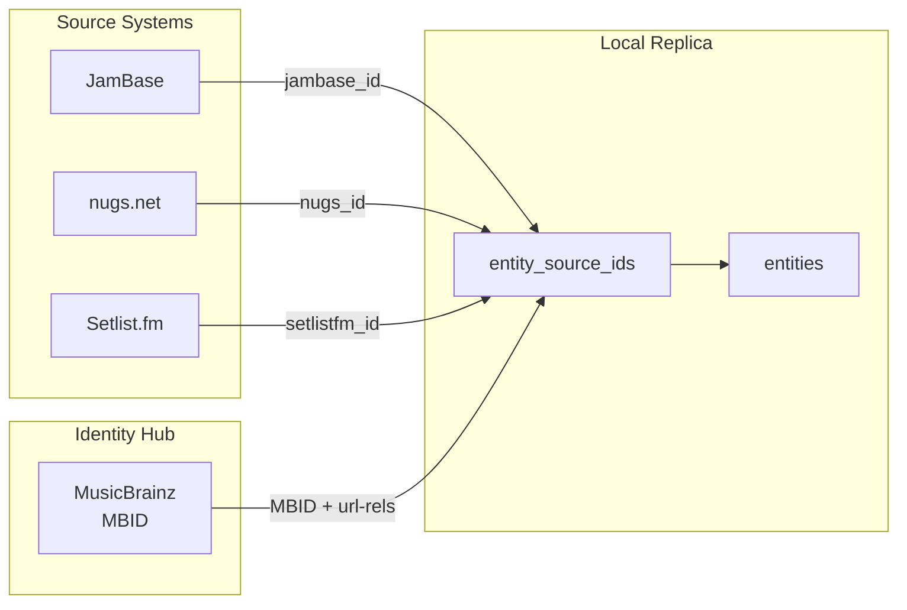
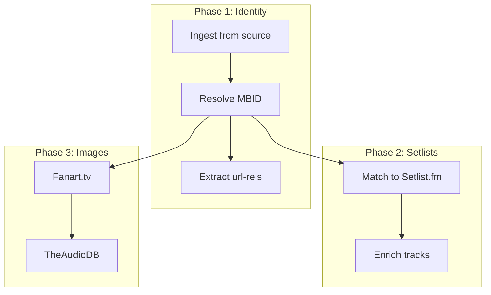

# Local Data Architecture

> Loaded on-demand by `tl-live-music-data` when designing a local replica/data warehouse for live music data. See `../SKILL.md` for the parent skill.

When your use case requires more than direct API calls — offline availability, custom indexing, multi-source enrichment, or high-volume reads — build a local replica.

## When to Build a Replica

| Use Case | Recommendation |
|----------|----------------|
| Real-time event lookups | Use API directly |
| Nightly sync for internal tools | Build replica |
| Search/filter beyond API capabilities | Build replica |
| High-volume reads (>10K/day) | Build replica |
| Offline/disconnected operation | Build replica |
| Multi-source enrichment | Build replica |

## Schema Pattern: External ID Mapping

```sql
CREATE TABLE entities (
    id UUID PRIMARY KEY,
    name VARCHAR(255) NOT NULL,
    entity_type VARCHAR(20) NOT NULL,
    canonical BOOLEAN DEFAULT true,
    merged_into_id UUID REFERENCES entities(id),
    created_at TIMESTAMP DEFAULT NOW()
);

CREATE TABLE entity_source_ids (
    id UUID PRIMARY KEY,
    entity_id UUID REFERENCES entities(id),
    source VARCHAR(50) NOT NULL,
    source_id VARCHAR(255) NOT NULL,
    is_primary BOOLEAN DEFAULT false,
    UNIQUE(source, source_id)
);

CREATE TABLE sync_state (
    id UUID PRIMARY KEY,
    source VARCHAR(50) NOT NULL UNIQUE,
    last_sync_at TIMESTAMP NOT NULL,
    records_synced INTEGER DEFAULT 0,
    sync_status VARCHAR(20) DEFAULT 'idle'
);
```

## Sync Patterns

Use `updatedOnDate`-based incremental sync with overlap window:

```javascript
async function syncEntities(source, lastSyncTime, overlapHours = 2) {
  const queryTime = new Date(lastSyncTime.getTime() - overlapHours * 60 * 60 * 1000);
  const records = await fetchFromSource(source, { updatedSince: queryTime });
  
  for (const record of records) {
    const entity = await db.entities.findBySourceId(source, record.id);
    if (entity) {
      await db.entities.update(entity.id, mapToEntity(record));
    } else {
      const newEntity = await db.entities.insert(mapToEntity(record));
      await db.entitySourceIds.insert({
        entityId: newEntity.id, source, sourceId: record.id, isPrimary: true
      });
    }
  }
}
```

## Overlap Recommendations

| Sync Frequency | Overlap Window | Rationale |
|----------------|----------------|-----------|
| Hourly | 15 minutes | Catch in-flight updates |
| Every 6 hours | 1 hour | Clock drift margin |
| Daily | 2 hours | Edge case buffer |
| Weekly | 1 day | Major change buffer |

## ID Resolution Flow



## Enrichment Pipeline



## Handling Deletions and Merges

**Soft-delete pattern**: Mark records as `canonical = false` rather than hard delete. Periodically verify against source.

**Merge workflow**: When an artist is merged upstream:
1. Detect via missing ID or redirect response
2. Create `merged_into_id` pointer
3. Update foreign keys to use canonical entity
4. Keep source ID mappings for backward compatibility
