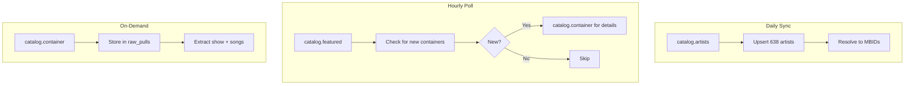

# nugs.net API Reference

**Role**: Live concert recordings catalog - shows, setlists, artists (undocumented but public)

## Quick Facts

| Property | Value |
|----------|-------|
| Primary URL | `https://streamapi.nugs.net/api.aspx` |
| Mirror URL | `https://api.livedownloads.com/api.aspx` |
| Auth | None required |
| Rate Limit | Undocumented (~2/sec safe) |
| Format | JSON |
| Docs | None (discovered via probing) |
| Artist Count | 638 (confirmed March 2026) |

## Important Note

This API is **undocumented** but publicly accessible. It was discovered through API probing in March 2026. The endpoints and parameters may change without notice.

## Confirmed Working Methods

| Method | Purpose | Key Finding |
|--------|---------|-------------|
| `catalog.artists` | Get ALL artists | 638 artists - no sitemap parsing needed |
| `catalog.container` | Full show details | Tracklist, venue, date, products, images |
| `catalog.search` | Full-text search | Groups by Artist, Song, Venue, Album |
| `catalog.featured` | New releases | Poll for recent shows |
| `catalog.popular` | Trending | Discover popular content |

## Endpoints

### List All Artists

```http
GET /api.aspx?method=catalog.artists&vdisp=1
```

**Response** (truncated):
```json
{
  "methodName": "catalog.artists",
  "responseAvailabilityCode": 0,
  "Response": {
    "artists": [
      {
        "artistID": 62,
        "artistName": "Phish",
        "artistNameNoThe": "phish",
        "numShows": 1247,
        "numAlbums": 0,
        "artistImage": "/assets/ld/images/ld_head_62.gif",
        "pageURL": "/live-music/3,62/Phish-mp3-flac-downloads.html"
      },
      {
        "artistID": 461,
        "artistName": "Grateful Dead",
        "artistNameNoThe": "grateful dead",
        "numShows": 234,
        "numAlbums": 45,
        "artistImage": "/assets/ld/images/ld_head_461.gif",
        "pageURL": "/live-music/3,461/Grateful-Dead-mp3-flac-downloads.html"
      },
      {
        "artistID": 991,
        "artistName": "Bruce Springsteen",
        "artistNameNoThe": "bruce springsteen",
        "numShows": 89,
        "numAlbums": 0,
        "artistImage": "/assets/ld/images/ld_head_991.gif",
        "pageURL": "/live-music/3,991/Bruce-Springsteen-mp3-flac-downloads.html"
      }
    ]
  }
}
```

Returns **all 638 artists** in the catalog. Use for seeding artist tables - eliminates need for sitemap parsing.

**Notable Artist IDs**:
| Artist | ID |
|--------|-----|
| Phish | 62 |
| Grateful Dead | 461 |
| Bruce Springsteen | 991 |
| Dead and Company | 1045 |
| Widespread Panic | 58 |

### Get Show Details (Container)

```http
GET /api.aspx?method=catalog.container&containerID={id}&vdisp=1
```

**Example**: Bruce Springsteen 12/31/1975 (containerID=12046)

**Response** (key fields):
```json
{
  "methodName": "catalog.container",
  "responseAvailabilityCode": 0,
  "responseAvailabilityCodeStr": "AVAILABLE",
  "Response": {
    "containerID": 12046,
    "artistID": 991,
    "artistName": "Bruce Springsteen",
    "licensorName": "Bruce Springsteen",
    "performanceDate": "12/31/1975",
    "performanceDateFormatted": "1975/12/31",
    "venueName": "Tower Theater",
    "venueCity": "Upper Darby",
    "venueState": "PA",
    "venue": "Tower Theater, Upper Darby, PA",
    "containerInfo": "12/31/75 Tower Theater, Upper Darby, PA",
    "containerType": 0,
    "containerTypeStr": "Show",
    "totalContainerRunningTime": 8316,
    "hhmmssTotalRunningTime": "02:18:36",
    "pageURL": "/live-music/0,12046/Bruce-Springsteen-mp3-flac-download-12-31-1975-Tower-Theater-Upper-Darby-PA.html",
    "img": {
      "picID": 57885,
      "url": "/images/shows/bs751231_02.jpg"
    },
    "songs": [
      {
        "songID": 41726,
        "songTitle": "Night",
        "discNum": 1,
        "trackNum": 1,
        "setNum": 1,
        "trackID": 733759,
        "clipURL": "https://assets.nugs.net/clips2/bs751231d1_01_Night_c.mp3"
      },
      {
        "songID": 45413,
        "songTitle": "Tenth Avenue Freeze-Out",
        "discNum": 1,
        "trackNum": 2,
        "setNum": 1,
        "trackID": 733760,
        "clipURL": "https://assets.nugs.net/clips2/bs751231d1_02_Tenth_Avenue_FreezeOut_c.mp3"
      }
    ],
    "products": [
      {
        "formatStr": "MP3",
        "skuID": 257645,
        "cost": 1499,
        "productStatusType": 1
      },
      {
        "formatStr": "FLAC",
        "skuID": 257646,
        "cost": 1899,
        "productStatusType": 1
      }
    ],
    "isInSubscriptionProgram": true,
    "catalogIds": ["nugs"]
  }
}
```

### Search Catalog

```http
GET /api.aspx?method=catalog.search&searchStr={query}&vdisp=1
```

**Example**: `catalog.search&searchStr=grateful`

**Response** (grouped by match type):
```json
{
  "methodName": "catalog.search",
  "responseAvailabilityCode": 0,
  "Response": {
    "catalogSearchResults": [
      {
        "matchType": 1,
        "matchTypeDescription": "Artist",
        "catalogSearchContainers": [
          {
            "containerID": 0,
            "artistID": 461,
            "artistName": "Grateful Dead",
            "numShows": 234
          }
        ]
      },
      {
        "matchType": 2,
        "matchTypeDescription": "Song",
        "numResults": 1500,
        "catalogSearchContainers": [...]
      },
      {
        "matchType": 3,
        "matchTypeDescription": "Venue",
        "numResults": 45,
        "catalogSearchContainers": [...]
      },
      {
        "matchType": 6,
        "matchTypeDescription": "Album",
        "numResults": 89,
        "catalogSearchContainers": [...]
      }
    ]
  }
}
```

**Match Types**:
| Code | Type | Notes |
|------|------|-------|
| 1 | Artist | Returns artist info with show count |
| 2 | Song | Returns containers containing matching songs |
| 3 | Venue | Returns shows at matching venues |
| 6 | Album | Returns studio albums |

### Featured Releases

```http
GET /api.aspx?method=catalog.featured&vdisp=1
```

Returns recently added shows - useful for polling new releases.

**Response structure**:
```json
{
  "methodName": "catalog.featured",
  "responseAvailabilityCode": 0,
  "Response": {
    "containers": [
      {
        "containerID": 12345,
        "artistID": 62,
        "artistName": "Phish",
        "performanceDate": "03/15/2026",
        "venueName": "Madison Square Garden",
        "venueCity": "New York",
        "venueState": "NY"
      }
    ]
  }
}
```

**Recommended polling**: Every 1 hour for new releases.

### Popular/Trending Shows

```http
GET /api.aspx?method=catalog.popular&vdisp=1
```

Returns currently trending/popular shows - useful for discovery.

**Response structure**: Same as `catalog.featured` but sorted by popularity metrics.

## Widget Embedding

nugs.net provides embeddable widgets for showing recordings:

```
Widget: https://cdn.nugs.net/widget/index.html
Demo:   https://cdn.nugs.net/widget/demo.html
```

**Widget Parameters**:
| Param | Type | Description | Example |
|-------|------|-------------|---------|
| `showId` | number | Container ID for single show | `showId=12046` |
| `recentByArtist` | number | Artist ID for recent shows carousel | `recentByArtist=62` |
| `theme` | string | Color theme | `light`, `dark` |
| `layout` | string | Layout style | `compact`, `full` |
| `width` | string | Widget width | `100%`, `400px` |
| `height` | string | Widget height | `300px` |

**Example embed URL**:
```
https://cdn.nugs.net/widget/index.html?showId=12046&theme=dark&layout=compact
```

The widget internally calls the same `streamapi.nugs.net` endpoints.

## Structured Data (HTML Pages)

Public nugs.net show pages (e.g., `https://www.nugs.net/live-music/0,12046/...`) include structured data that can supplement API data:

### JSON-LD Product Schema

```html
<script type="application/ld+json">
{
  "@context": "https://schema.org",
  "@type": "Product",
  "sku": "12046",
  "name": "Bruce Springsteen - 12/31/1975 - Tower Theater, Upper Darby, PA",
  "image": "https://www.nugs.net/images/shows/bs751231_02.jpg",
  "description": "Live recording from Tower Theater on December 31, 1975",
  "offers": {
    "@type": "Offer",
    "price": "14.99",
    "priceCurrency": "USD"
  }
}
</script>
```

The `sku` field matches `containerID` - useful for cross-referencing.

### OpenGraph Tags

```html
<meta property="og:title" content="Bruce Springsteen at Tower Theater on Dec 31, 1975">
<meta property="og:description" content="Live recording from Tower Theater, Upper Darby, PA">
<meta property="og:image" content="https://www.nugs.net/images/shows/bs751231_02.jpg">
<meta property="og:url" content="https://www.nugs.net/live-music/0,12046/...">
```

**Use cases for HTML parsing**:
- Fallback if API unavailable
- SEO-friendly description text
- High-res image URLs
- Pricing information

## TypeScript Implementation

```typescript
interface NugsArtist {
  artistID: number;
  artistName: string;
  artistNameNoThe: string;
  numShows: number;
  numAlbums: number;
  artistImage: string;
  pageURL: string;
}

interface NugsSong {
  songID: number;
  songTitle: string;
  discNum: number;
  trackNum: number;
  setNum: number;
  trackID: number;
  clipURL?: string;
}

interface NugsContainerImage {
  picID: number;
  url: string;
}

interface NugsProduct {
  formatStr: string;
  skuID: number;
  cost: number;
  productStatusType: number;
}

interface NugsContainer {
  containerID: number;
  artistID: number;
  artistName: string;
  licensorName: string;
  performanceDate: string;
  performanceDateFormatted: string;
  venueName: string;
  venueCity: string;
  venueState: string;
  venue: string;
  containerInfo: string;
  containerType: number;
  containerTypeStr: string;
  totalContainerRunningTime: number;
  hhmmssTotalRunningTime: string;
  pageURL: string;
  img: NugsContainerImage;
  songs: NugsSong[];
  products: NugsProduct[];
  isInSubscriptionProgram: boolean;
  catalogIds: string[];
}

interface NugsApiResponse<T> {
  methodName: string;
  responseAvailabilityCode: number;
  responseAvailabilityCodeStr?: string;
  Response: T;
}

const NUGS_DELAY = 500; // Conservative rate limit (~2/sec)
let lastRequest = 0;

async function sleep(ms: number): Promise<void> {
  return new Promise(resolve => setTimeout(resolve, ms));
}

async function nugsFetch<T>(method: string, params: Record<string, string> = {}): Promise<NugsApiResponse<T>> {
  const now = Date.now();
  const wait = Math.max(0, NUGS_DELAY - (now - lastRequest));
  if (wait > 0) await sleep(wait);
  
  lastRequest = Date.now();
  
  const url = new URL('https://streamapi.nugs.net/api.aspx');
  url.searchParams.set('method', method);
  url.searchParams.set('vdisp', '1');
  
  for (const [key, value] of Object.entries(params)) {
    url.searchParams.set(key, value);
  }
  
  const response = await fetch(url.toString());
  return response.json();
}

async function getAllArtists(): Promise<NugsArtist[]> {
  const data = await nugsFetch<{ artists: NugsArtist[] }>('catalog.artists');
  return data.Response.artists;
}

async function getContainer(containerID: number): Promise<NugsContainer> {
  const data = await nugsFetch<NugsContainer>('catalog.container', { 
    containerID: String(containerID) 
  });
  return data.Response;
}

async function searchCatalog(query: string) {
  const data = await nugsFetch<{ catalogSearchResults: any[] }>('catalog.search', { 
    searchStr: query 
  });
  return data.Response.catalogSearchResults;
}

async function getFeatured() {
  const data = await nugsFetch<{ containers: any[] }>('catalog.featured');
  return data.Response.containers;
}

async function getPopular() {
  const data = await nugsFetch<{ containers: any[] }>('catalog.popular');
  return data.Response.containers;
}
```

## Linking to MusicBrainz

nugs.net doesn't provide MBIDs, so resolution is by artist name search against MusicBrainz:

```typescript
interface MusicBrainzArtist {
  id: string;
  name: string;
  score: number;
  disambiguation?: string;
  type?: string;
}

interface MusicBrainzSearchResponse {
  artists: MusicBrainzArtist[];
}

async function resolveNugsArtistToMbid(
  nugsArtistName: string
): Promise<{ mbid: string; confidence: 'exact' | 'high' | 'low' } | null> {
  const response = await fetch(
    `https://musicbrainz.org/ws/2/artist?query=${encodeURIComponent(nugsArtistName)}&fmt=json`,
    {
      headers: {
        'User-Agent': 'Colitas/1.0 (contact@example.com)'
      }
    }
  );
  
  const data: MusicBrainzSearchResponse = await response.json();
  
  if (!data.artists?.length) return null;
  
  const best = data.artists[0];
  
  if (best.score === 100) {
    return { mbid: best.id, confidence: 'exact' };
  }
  
  if (best.score >= 90) {
    return { mbid: best.id, confidence: 'high' };
  }
  
  if (best.score >= 75) {
    return { mbid: best.id, confidence: 'low' };
  }
  
  return null;
}
```

**Tips for better matching**:
- Use `artistNameNoThe` from nugs API (already lowercased, "the" removed)
- For groups (e.g., "Grateful Dead"), also try with "The" prefix
- Store match confidence to flag uncertain mappings for review

## Common Gotchas

1. **Undocumented API** - May change without notice; test endpoints periodically
2. **No MBID integration** - Must resolve via MusicBrainz artist name search
3. **Rate limit unknown** - Use conservative ~500ms delay (2 req/sec) to be safe
4. **`vdisp=1` parameter** - Required for proper JSON response format; omitting it may return different structure
5. **Numeric IDs** - Most IDs return as numbers, not strings (unlike sample code in older docs)
6. **Date formats** - `performanceDate` uses "MM/DD/YYYY", `performanceDateFormatted` uses "YYYY/MM/DD"
7. **Single artist per container** - Multi-artist shows (collectives, sit-ins) appear under primary artist only
8. **Old containers may 404** - Some very old containerIDs return HTML error pages instead of JSON
9. **pageURL is relative** - Prepend `https://www.nugs.net` to construct full URLs

## Recommended Ingestion Strategy

The discovery of `catalog.artists` eliminates the need for sitemap parsing:



**Job schedule**:
| Job | Frequency | Purpose |
|-----|-----------|---------|
| `sync-artists` | Daily | Refresh artist list, detect new artists |
| `poll-featured` | Hourly | Discover new releases |
| `fetch-container` | On-demand | Get full show details |
| `resolve-mbid` | After artist sync | Link artists to MusicBrainz |

## Caching Recommendations

| Data | TTL | Rationale |
|------|-----|-----------|
| Artist list | 24 hours | Rarely changes, ~638 artists |
| Show details | 7 days | Historical data is immutable |
| Search results | 4 hours | May include new releases |
| Featured/Popular | 1 hour | Changes frequently |
| Raw API responses | 30 days | For change detection via content hash |

---

## Keeping Current

### Authoritative Documentation

**None** - This API is undocumented and was discovered via probing.

| Resource | URL |
|----------|-----|
| Main Site | https://www.nugs.net |
| Player App | https://play.nugs.net |
| Widget Demo | https://cdn.nugs.net/widget/demo.html |

### Version Detection

No formal versioning. Monitor for changes via:

1. **Response structure changes** - Hash responses and compare over time
2. **New methods** - Periodically probe for new `method=catalog.*` options
3. **URL changes** - Watch if base URLs redirect or return errors

### Test Endpoint

Verify API is responding:

```http
GET https://streamapi.nugs.net/api.aspx?method=catalog.artists&vdisp=1
```

Expected: Returns JSON with `Response.artists` array (~638 artists).

### Stability Warning

This is an **undocumented internal API**:
- May change without notice
- No SLA or support
- Use defensive coding (handle missing fields)
- Cache raw responses to detect changes via content hash

### Last Verified

- **Date**: March 2026
- **Verified by**: API probing (no official docs available)
